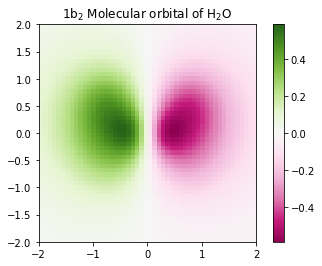

# PyQInt

[](https://anaconda.org/ifilot/pyqint)
[](https://pypi.org/project/pyqint/)

__Table of Contents__

* [Purpose](#purpose)
* [Installation](#installation)
    - [Anaconda](#anaconda)
    - [PyPi](#pypi)
* [Usage](#usage)
    - [Overlap integrals](#overlap-integrals)
    - [Kinetic integrals](#kinetic-integrals)
    - [Nuclear attraction integrals](#nuclear-attraction-integrals)
    - [Two-electron integrals](#two-electron-integrals)
    - [Construction of Contracted Gaussian Functions](#construction-of-contracted-gaussian-functions)
    - [Quick evaluation of integrals](#parallel-evaluation-of-integrals)
    - [Plotting molecular orbitals](#plotting-molecular-orbitals)
    - [Performing Hartree-Fock calculations](#performing-hartree-fock-calculations)

## Purpose

PyQInt is a Python package for calculating one- and two-electron integrals as encountered in electronic structure calculations. Since integral evaluation can be quite computationally intensive, they are programmed in C++ and connected to Python using Cython.

## Installation

### Anaconda

[](https://anaconda.org/ifilot/pyqint)
[](https://anaconda.org/ifilot/pyqint)
[](https://anaconda.org/ifilot/pyqint)
[](https://conda.anaconda.org/ifilot)

Open Anaconda prompt and type

```
conda install -c ifilot pyqint
```

### PyPi

[](https://pypi.org/project/pyqint/)
[](https://pypi.org/project/pyqint/)


Open a terminal and type

```
pip install pyqint
```

## Usage

### Overlap integrals
```python
from pyqint import PyQInt, cgf, gto
import numpy as np
from copy import deepcopy

# construct integrator object
integrator = PyQInt()

# build cgf for hydrogen separated by 1.4 a.u.
cgf1 = cgf([0.0, 0.0, 0.0])

cgf1.add_gto(0.154329, 3.425251, 0, 0, 0)
cgf1.add_gto(0.535328, 0.623914, 0, 0, 0)
cgf1.add_gto(0.444635, 0.168855, 0, 0, 0)

# create a copy of the CGF
cgf2 = deepcopy(cgf1)
cgf2.p[2] = 1.4

# construct empty matrix
S = np.zeros((2,2))
S[0,0] = integrator.overlap(cgf1, cgf1)
S[0,1] = S[1,0] = integrator.overlap(cgf1, cgf2)
S[1,1] = integrator.overlap(cgf2, cgf2)

# output result
print(S)
```

### Kinetic integrals
```python
from pyqint import PyQInt, cgf, gto
import numpy as np
from copy import deepcopy

# construct integrator object
integrator = PyQInt()

# build cgf for hydrogen separated by 1.4 a.u.
cgf1 = cgf([0.0, 0.0, 0.0])

cgf1.add_gto(0.154329, 3.425251, 0, 0, 0)
cgf1.add_gto(0.535328, 0.623914, 0, 0, 0)
cgf1.add_gto(0.444635, 0.168855, 0, 0, 0)

# create a copy of the CGF
cgf2 = deepcopy(cgf1)
cgf2.p[2] = 1.4

# construct empty matrix
T = np.zeros((2,2))
T[0,0] = integrator.kinetic(cgf1, cgf1)
T[0,1] = T[1,0] = integrator.kinetic(cgf1, cgf2)
T[1,1] = integrator.kinetic(cgf2, cgf2)

# output result
print(T)
```

### Nuclear attraction integrals
```python
from pyqint import PyQInt, cgf, gto
import numpy as np
from copy import deepcopy

# construct integrator object
integrator = PyQInt()

# build cgf for hydrogen separated by 1.4 a.u.
cgf1 = cgf([0.0, 0.0, 0.0])

cgf1.add_gto(0.154329, 3.425251, 0, 0, 0)
cgf1.add_gto(0.535328, 0.623914, 0, 0, 0)
cgf1.add_gto(0.444635, 0.168855, 0, 0, 0)

# create a copy of the CGF
cgf2 = deepcopy(cgf1)
cgf2.p[2] = 1.4

# Build nuclear attraction integrals
V1 = np.zeros((2,2))
V1[0,0] = integrator.nuclear(cgf1, cgf1, cgf1.p, 1)
V1[0,1] = V1[1,0] = integrator.nuclear(cgf1, cgf2, cgf1.p, 1)
V1[1,1] = integrator.nuclear(cgf2, cgf2, cgf1.p, 1)

V2 = np.zeros((2,2))
V2[0,0] = integrator.nuclear(cgf1, cgf1, cgf2.p, 1)
V2[0,1] = V2[1,0] = integrator.nuclear(cgf1, cgf2, cgf2.p, 1)
V2[1,1] = integrator.nuclear(cgf2, cgf2, cgf2.p, 1)

# print result
print(V1,V2)
```

### Two-electron integrals

```python
from pyqint import PyQInt, cgf, gto
import numpy as np
from copy import deepcopy

# construct integrator object
integrator = PyQInt()

# build cgf for hydrogen separated by 1.4 a.u.
cgf1 = cgf([0.0, 0.0, 0.0])

cgf1.add_gto(0.154329, 3.425251, 0, 0, 0)
cgf1.add_gto(0.535328, 0.623914, 0, 0, 0)
cgf1.add_gto(0.444635, 0.168855, 0, 0, 0)

# create a copy of the CGF
cgf2 = deepcopy(cgf1)
cgf2.p[2] = 1.4

T1111 = integrator.repulsion(cgf1, cgf1, cgf1, cgf1)
T1122 = integrator.repulsion(cgf1, cgf1, cgf2, cgf2)
T1112 = integrator.repulsion(cgf1, cgf1, cgf1, cgf2)
T2121 = integrator.repulsion(cgf2, cgf1, cgf2, cgf1)
T1222 = integrator.repulsion(cgf1, cgf2, cgf2, cgf2)
T2211 = integrator.repulsion(cgf2, cgf2, cgf1, cgf1)

print(T1111)
print(T1122)
print(T1112)
print(T2121)
print(T1222)
print(T2211)
```

### Construction of Contracted Gaussian Functions

```python
from pyqint import PyQInt, Molecule
import numpy as np

# construct integrator object
integrator = PyQInt()

# build hydrogen molecule
mol = Molecule()
mol.add_atom('H', 0.0, 0.0, 0.0)
mol.add_atom('H', 0.0, 0.0, 1.4)
cgfs, nuclei = mol.build_basis('sto3g')

print(cgfs, nuclei)
```

### Parallel evaluation of integrals

From a collection of Contracted Gaussian Functions, the complete set of overlap, kinetic, nuclear attraction and two-electron integrals
can be quickly evaluated using the `build_integrals` function. Using the `npar` argument, the number of threads to be spawned can be set.

```python
from pyqint import PyQInt, Molecule
import numpy as np
import multiprocessing

# construct integrator object
integrator = PyQInt()

# build hydrogen molecule
mol = Molecule()
mol.add_atom('H', 0.0, 0.0, 0.0)
mol.add_atom('H', 0.0, 0.0, 1.4)
cgfs, nuclei = mol.build_basis('sto3g')

# evaluate all integrals
ncpu = multiprocessing.cpu_count()
S, T, V, teint = integrator.build_integrals(cgfs, nuclei, npar=ncpu, verbose=False)

print(S, T, V, teint)
```

### Plotting molecular orbitals



```python
from pyqint import PyQInt, Molecule
import matplotlib.pyplot as plt
import numpy as np

# coefficients (calculated by Hartree-Fock using a sto-3g basis set)
coeff = [8.37612e-17, -2.73592e-16,  -0.713011, -1.8627e-17, 9.53496e-17, -0.379323,  0.379323]

# construct integrator object
integrator = PyQInt()

# build water molecule
mol = Molecule('H2O')
mol.add_atom('O', 0.0, 0.0, 0.0)
mol.add_atom('H', 0.7570, 0.5860, 0.0)
mol.add_atom('H', -0.7570, 0.5860, 0.0)
cgfs, nuclei = mol.build_basis('sto3g')

# build grid
x = np.linspace(-2, 2, 50)
y = np.linspace(-2, 2, 50)
xx, yy = np.meshgrid(x,y)
zz = np.zeros(len(x) * len(y))
grid = np.vstack([xx.flatten(), yy.flatten(), zz]).reshape(3,-1).T
res = integrator.plot_wavefunction(grid, coeff, cgfs).reshape((len(y), len(x)))

# plot wave function
plt.imshow(res, origin='lower', extent=[-2,2,-2,2], cmap='PiYG')
plt.colorbar()
plt.title('1b$_{2}$ Molecular orbital of H$_{2}$O')
```

### Performing Hartree-Fock calculations

```python
from pyqint import PyQInt, Molecule, HF
import numpy as np
import matplotlib.pyplot as plt
from mpl_toolkits.axes_grid1 import make_axes_locatable

def main():
    # calculate sto-3g coefficients for h2o
    cgfs, coeff = calculate_co()

    # visualize orbitals
    fig, ax = plt.subplots(2,3, figsize=(18,10))
    for i in range(0,2):
        for j in range(0,3):
            dens = plot_wavefunction(cgfs, coeff[:,i*3+j])
            limit = max(abs(np.min(dens)), abs(np.max(dens)) )
            im = ax[i,j].imshow(dens, origin='lower', interpolation='bilinear',
              extent=[-2,2,-2,2], cmap='PiYG', vmin=-limit, vmax=limit)
            ax[i,j].set_xlabel('Distance a.u.')
            ax[i,j].set_ylabel('Distance a.u.')
            divider = make_axes_locatable(ax[i,j])
            cax = divider.append_axes('right', size='5%', pad=0.05)
            fig.colorbar(im, cax=cax, orientation='vertical')

def calculate_co():
    mol = Molecule()
    mol.add_atom('C', 0.0, -0.5, 0.0)
    mol.add_atom('O', 0.0, 0.5, 0.0)

    result = HF().rhf(mol, 'sto3g')

    return result['cgfs'], result['orbc']

def plot_wavefunction(cgfs, coeff):
    # build integrator
    integrator = PyQInt()

    # build grid
    x = np.linspace(-2, 2, 100)
    y = np.linspace(-2, 2, 100)
    xx, yy = np.meshgrid(x,y)
    zz = np.zeros(len(x) * len(y))
    grid = np.vstack([xx.flatten(), yy.flatten(), zz]).reshape(3,-1).T
    res = integrator.plot_wavefunction(grid, coeff, cgfs).reshape((len(y), len(x)))

    return res

if __name__ == '__main__':
    main()
```

### Constructing isosurfaces

By installing the [PyTessel](https://github.com/ifilot/pytessel) package, you can construct an isosurface from a wave function scalar field.

```python
from pyqint import PyQInt, Molecule, HF
import numpy as np
from pytessel import PyTessel

def main():
    # calculate sto-3g coefficients for h2o
    cgfs, coeff = calculate_co()

    # build isosurface of the fifth MO
    # isovalue = 0.1
    # store result as .ply file
    build_isosurface('co_04.ply', cgfs, coeff[:,4], 0.1)

def build_isosurface(filename, cgfs, coeff, isovalue):
    # generate some data
    sz = 100
    integrator = PyQInt()
    grid = integrator.build_rectgrid3d(-5, 5, sz)
    scalarfield = np.reshape(integrator.plot_wavefunction(grid, coeff, cgfs), (sz, sz, sz), order='F')
    unitcell = np.diag(np.ones(3) * 10.0)

    pytessel = PyTessel()
    vertices, normals, indices = pytessel.marching_cubes(scalarfield.flatten(), scalarfield.shape, unitcell.flatten(), 0.1)
    pytessel.write_ply(filename, vertices, normals, indices)

def calculate_co():
    mol = Molecule()
    mol.add_atom('C', 0.0, -0.5, 0.0)
    mol.add_atom('O', 0.0, 0.5, 0.0)

    result = HF().rhf(mol, 'sto3g')

    return result['cgfs'], result['orbc']

if __name__ == '__main__':
    main()
```
