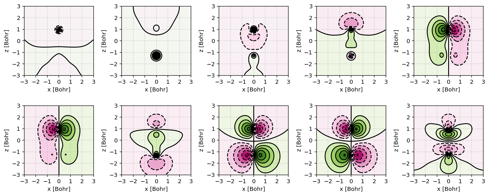

.. index:: _electronic_structure_calculations

Electronic structure calculations
=================================

.. contents:: Table of Contents
    :depth: 3

The :program:`PyQInt` package provides two flavors of Hartree-Fock electronic
structure calculations: **restricted Hartree-Fock (RHF)** and
**unrestricted Hartree-Fock (UHF)**. The restricted formulation is suitable for
closed-shell systems, whereas the unrestricted formulation allows for the
treatment of open-shell systems with unpaired electrons.

Both approaches expose detailed intermediate results, allowing the user to
inspect orbital coefficients, density matrices, Fock matrices, and energy
contributions throughout the self-consistent field (SCF) procedure.

Restricted Hartree-Fock
-----------------------

Below, an example of an **restricted** Hartree-Fock calculation is given.

.. code-block:: python

    from pyqint import PyQInt, MoleculeBuilder, HF
    import numpy as np
    import matplotlib.pyplot as plt
    from mpl_toolkits.axes_grid1 import make_axes_locatable

    def main():
        # calculate sto3g coefficients for h2o
        cgfs, coeff = calculate_co()

        # visualize orbitals
        fig, ax = plt.subplots(2,5, figsize=(12, 5), dpi=144)
        sz = 3
        for i in range(0,2):
            for j in range(0,5):
                dens = plot_wavefunction(cgfs, coeff[:,i*5+j], sz=sz)
                limit = max(abs(np.min(dens)), abs(np.max(dens)) )
                im = ax[i,j].contourf(dens, origin='lower',
                  extent=[-sz, sz, -sz, sz], cmap='PiYG', vmin=-limit, vmax=limit,
                  levels=11)
                im = ax[i,j].contour(dens, origin='lower', colors='black',
                  extent=[-sz, sz, -sz, sz], vmin=-limit, vmax=limit,
                  levels=11)
                ax[i,j].set_xlabel('x [Bohr]')
                ax[i,j].set_ylabel('z [Bohr]')
                ax[i,j].set_aspect('equal', adjustable='box')
                ax[i,j].set_xticks(np.linspace(-3,3, 7))
                ax[i,j].set_yticks(np.linspace(-3,3, 7))
                ax[i,j].grid(linestyle='--', alpha=0.5)
        plt.tight_layout()
        plt.show()

    def calculate_co():
        mol = MoleculeBuilder.from_name('CO')

        result = HF(mol, 'sto3g').rhf()

        return result['cgfs'], result['orbc']

    def plot_wavefunction(cgfs, coeff, sz=3.5):
        # build integrator
        integrator = PyQInt()

        # build grid
        x = np.linspace(-sz, sz, 150)
        z = np.linspace(-sz, sz, 150)
        xx, zz = np.meshgrid(x,z)
        yy = np.zeros(len(x) * len(z))
        grid = np.vstack([xx.flatten(), yy, zz.flatten()]).reshape(3,-1).T
        res = integrator.plot_wavefunction(grid, coeff, cgfs).reshape((len(z), len(x)))

        return res

    if __name__ == '__main__':
        main()

    Canonical molecular orbitals of CO visualized using contour plots.

.. hint::

   The manual construction of contour plots shown above provides full control
   over grid generation and visualization. For convenience, :program:`PyQInt`
   also provides the :code:`ContourPlotter` helper class (see
   :ref:`contourplotter_helper`) which encapsulates this workflow and allows
   rapid generation of grids of molecular orbital contour plots with minimal
   boilerplate code.

Result dictionary (RHF)
***********************

The result of a Hartree-Fock calculation is captured inside a dictionary
object. This dictionary objects contains the following keys

.. list-table:: Description of the data contained in the result library
   :widths: 25 75
   :header-rows: 1

   * - Key
     - Description
   * - :code:`energy`
     - Final energy of the electronic structure calculation
   * - :code:`nuclei`
     - List of elements and their position in Bohr units
   * - :code:`cgfs`
     - List of contracted Gaussian functional objects
   * - :code:`energies`
     - List of energies during the self-convergence procedure
   * - :code:`orbe`
     - Orbital energies (converged) (array of N element)
   * - :code:`orbc`
     - Orbital coefficients (converted) (matrix of N x N elements)
   * - :code:`density`
     - Density matrix :math:`\mathbf{P}`
   * - :code:`fock`
     - Fock matrix :math:`\mathbf{F}`
   * - :code:`transform`
     - Unitary transformation matrix :math:`\mathbf{X}`
   * - :code:`overlap`
     - Overlap matrix :math:`\mathbf{S}`
   * - :code:`kinetic`
     - Kinetic energy matrix :math:`\mathbf{T}`
   * - :code:`nuclear`
     - Nuclear attraction matrix :math:`\mathbf{V}`
   * - :code:`hcore`
     - Core Hamiltonian matrix :math:`\mathbf{H_\textrm{core}}`
   * - :code:`tetensor`
     - Two-electron tensor object :math:`(i,j,k,l)`
   * - :code:`time_stats`
     - Time statistics object
   * - :code:`ecore`
     - Sum of kinetic and nuclear attraction energy
   * - :code:`ekin`
     - Total kinetic energy
   * - :code:`enuc`
     - Total nuclear attraction energy
   * - :code:`erep`
     - Total electron-electron repulsion energy
   * - :code:`ex`
     - Total exchange energy
   * - :code:`enucrep`
     - Electrostatic repulsion energy of the nuclei
   * - :code:`nelec`
     - Total number of electrons
   * - :code:`mol`
     - Molecule class
   * - :code:`forces`
     - Forces on the atoms (if calculated, else :code:`None`)

To provide an example how one can use the above data, let us consider the
situation wherein the user wants to decompose the individual components of the
total energy as given by

.. math::

    E_{\textrm{total}} = E_{\textrm{kin}} + E_{\textrm{nuc}} + E_{\textrm{e-e}} + E_{\textrm{ex}} + E_{\textrm{nuc,rep}}

Via the script below, one can easily verify that the above equation holds and
that the total energy is indeed the sum of the kinetic, nuclear attraction,
electron-electron repulsion, exchange and nuclear repulsion energies within a
Hartree-Fock calculation.

.. code-block:: python

    from pyqint import MoleculeBuilder,HF

    mol = MoleculeBuilder.from_name('ch4')
    mol.name = 'CH4'

    res = HF(mol, 'sto3g').rhf()
    print()
    print('Kinetic energy: ', res['ekin'])
    print('Nuclear attraction energy: ', res['enuc'])
    print('Electron-electron repulsion: ', res['erep'])
    print('Exchange energy: ', res['ex'])
    print('Repulsion between nuclei: ', res['enucrep'])
    print()
    print('Total energy: ', res['energy'])
    print('Sum of the individual terms: ',
          res['ekin'] + res['enuc'] + res['erep'] + res['ex'] + res['enucrep'])

The output of the above script yields::

    Kinetic energy:  39.42613774982387
    Nuclear attraction energy:  -118.63789179775034
    Electron-electron repulsion:  32.7324270326041
    Exchange energy:  -6.609004673631048
    Repulsion between nuclei:  13.362026647057352

    Total energy:  -39.72630504189621
    Sum of the individual terms:  -39.726305041896055

Unrestricted Hartree-Fock (UHF)
-------------------------------

For systems containing unpaired electrons, such as radicals or atoms with open
shells, the restricted Hartree-Fock approximation is no longer appropriate.
In such cases, :program:`PyQInt` provides an **unrestricted Hartree-Fock (UHF)**
implementation via the :code:`uhf()` method.

In UHF, separate spatial orbitals are used for spin-up (:math:`\alpha`) and
spin-down (:math:`\beta`) electrons. This leads to distinct α and β density
matrices and Fock matrices, allowing the electronic structure to exhibit spin
polarization.

As a representative example, consider the methyl radical (CH₃), which has one
unpaired electron and therefore requires an unrestricted treatment. The geometry
used below places the carbon atom at the origin, with three hydrogen atoms
arranged in a planar configuration with H-C-H angles of 120 degrees and a C-H
bond length of 2.039 Bohr.

.. code-block:: python

    from pyqint import Molecule, HF
    import numpy as np

    R = 2.039
    sqrt3 = np.sqrt(3.0)

    mol = Molecule()
    mol.add_atom('C', 0.0, 0.0, 0.0)
    mol.add_atom('H',  R, 0.0, 0.0)
    mol.add_atom('H', -0.5 * R,  0.5 * sqrt3 * R, 0.0)
    mol.add_atom('H', -0.5 * R, -0.5 * sqrt3 * R, 0.0)

    # CH3 is a doublet (multiplicity = 2)
    res = HF(mol, 'sto3g').uhf(multiplicity=2)

    print('Total energy:', res['energy'])

Result dictionary (UHF)
***********************

The result of an unrestricted Hartree-Fock (UHF) calculation is likewise captured
inside a dictionary object. Compared to restricted Hartree-Fock, the UHF result
dictionary contains **spin-resolved quantities**, reflecting the fact that
different spatial orbitals are used for spin-up (:math:`\alpha`) and spin-down
(:math:`\beta`) electrons.

Below, the most important entries of the UHF result dictionary are listed.

.. list-table:: Description of the data contained in the UHF result dictionary
   :widths: 25 75
   :header-rows: 1

   * - Key
     - Description
   * - :code:`energy`
     - Final total electronic energy
   * - :code:`nuclei`
     - List of elements and their position in Bohr units
   * - :code:`cgfs`
     - List of contracted Gaussian functional objects
   * - :code:`energies`
     - List of total energies during the SCF convergence procedure
   * - :code:`orbe_alpha`
     - Converged orbital energies for spin-up (:math:`\alpha`) electrons
   * - :code:`orbe_beta`
     - Converged orbital energies for spin-down (:math:`\beta`) electrons
   * - :code:`orbc_alpha`
     - Orbital coefficient matrix for :math:`\alpha` electrons
   * - :code:`orbc_beta`
     - Orbital coefficient matrix for :math:`\beta` electrons
   * - :code:`density_alpha`
     - Density matrix :math:`\mathbf{P}^{\alpha}` for spin-up electrons
   * - :code:`density_beta`
     - Density matrix :math:`\mathbf{P}^{\beta}` for spin-down electrons
   * - :code:`density`
     - Total density matrix :math:`\mathbf{P} = \mathbf{P}^{\alpha} + \mathbf{P}^{\beta}`
   * - :code:`fock_alpha`
     - Fock matrix for :math:`\alpha` electrons
   * - :code:`fock_beta`
     - Fock matrix for :math:`\beta` electrons
   * - :code:`transform`
     - Unitary transformation matrix :math:`\mathbf{X}`
   * - :code:`overlap`
     - Overlap matrix :math:`\mathbf{S}`
   * - :code:`kinetic`
     - Kinetic energy matrix :math:`\mathbf{T}`
   * - :code:`nuclear`
     - Nuclear attraction matrix :math:`\mathbf{V}`
   * - :code:`hcore`
     - Core Hamiltonian matrix :math:`\mathbf{H_{\textrm{core}}}`
   * - :code:`tetensor`
     - Two-electron integral tensor :math:`(i,j,k,l)`
   * - :code:`time_stats`
     - Time statistics object

In unrestricted Hartree-Fock, the exchange contribution is spin-dependent.
Accordingly, the exchange energy is split into separate :math:`\alpha` and
:math:`\beta` components.

.. list-table:: UHF energy contributions
   :widths: 25 75
   :header-rows: 1

   * - Key
     - Description
   * - :code:`ecore`
     - Sum of kinetic and nuclear attraction energy
   * - :code:`ej`
     - Coulomb (Hartree) energy
   * - :code:`ex_alpha`
     - Exchange energy contribution from :math:`\alpha` electrons
   * - :code:`ex_beta`
     - Exchange energy contribution from :math:`\beta` electrons
   * - :code:`enucrep`
     - Electrostatic repulsion energy of the nuclei

In addition to the electronic structure data, the UHF result dictionary contains
explicit information about the spin state of the system.

.. list-table:: Spin-related quantities
   :widths: 25 75
   :header-rows: 1

   * - Key
     - Description
   * - :code:`nelec`
     - Total number of electrons
   * - :code:`nalpha`
     - Number of spin-up (:math:`\alpha`) electrons
   * - :code:`nbeta`
     - Number of spin-down (:math:`\beta`) electrons
   * - :code:`multiplicity`
     - Spin multiplicity :math:`(2S + 1)`

.. note::

   Unlike restricted Hartree-Fock, unrestricted Hartree-Fock allows for spin
   polarization. As a consequence, the resulting wavefunction is generally not
   an exact eigenfunction of the total spin operator, which may lead to spin
   contamination.

Custom basis sets
-----------------

Besides the basis sets offered by :program:`PyQInt`, one can also use a custom
basis set defined by the user. The :code:`rhf` routine accepts either a basis set
for its :code:`basis` argument, or alternatively a list of :code:`cgf` objects.
In the example code shown below, the latter is done.

.. code-block:: python

    from pyqint import Molecule, HF, cgf
    mol = Molecule()
    mol.add_atom('H', 0.0000, 0.0000, 0.3561150187, unit='angstrom')
    mol.add_atom('H', 0.0000, 0.0000, -0.3561150187, unit='angstrom')        
    nuclei = mol.get_nuclei()

    cgfs = []
    for n in nuclei:
        cgf = CGF(n[0])

        cgf.add_gto(0.154329, 3.425251, 0, 0, 0)
        cgf.add_gto(0.535328, 0.623914, 0, 0, 0)
        cgf.add_gto(0.444635, 0.168855, 0, 0, 0)

        cgfs.append(cgf)

    res = HF(mol, basis=cgfs).rhf(verbose=True)

.. hint::

    A nice website to find a large collection of Gaussian Type basis set coefficients is
    `https://www.basissetexchange.org/ <https://www.basissetexchange.org/>`_.