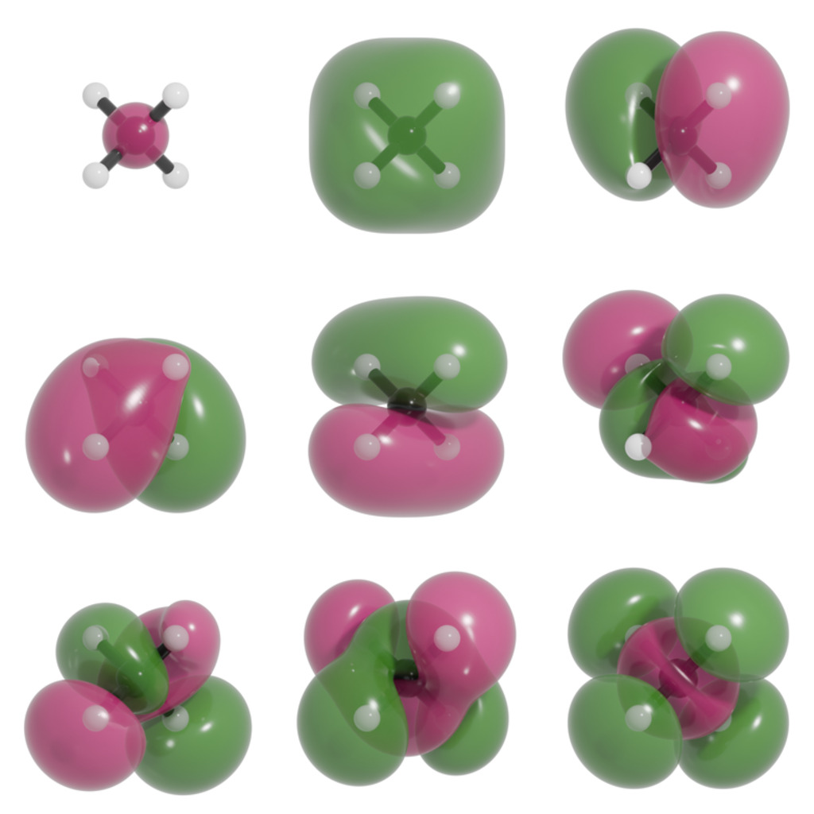
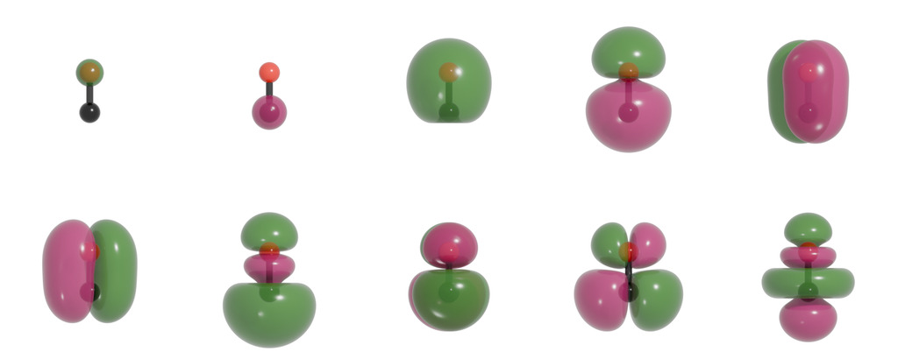
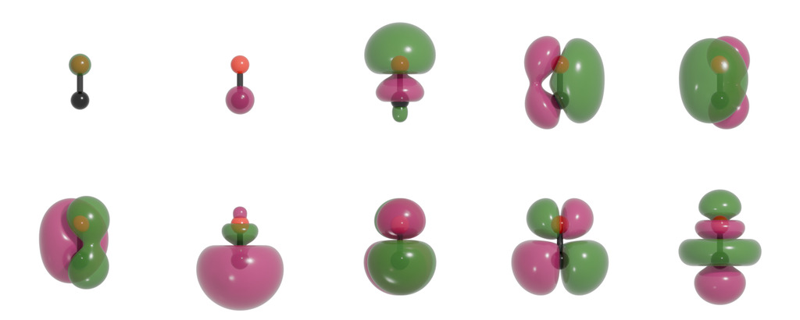
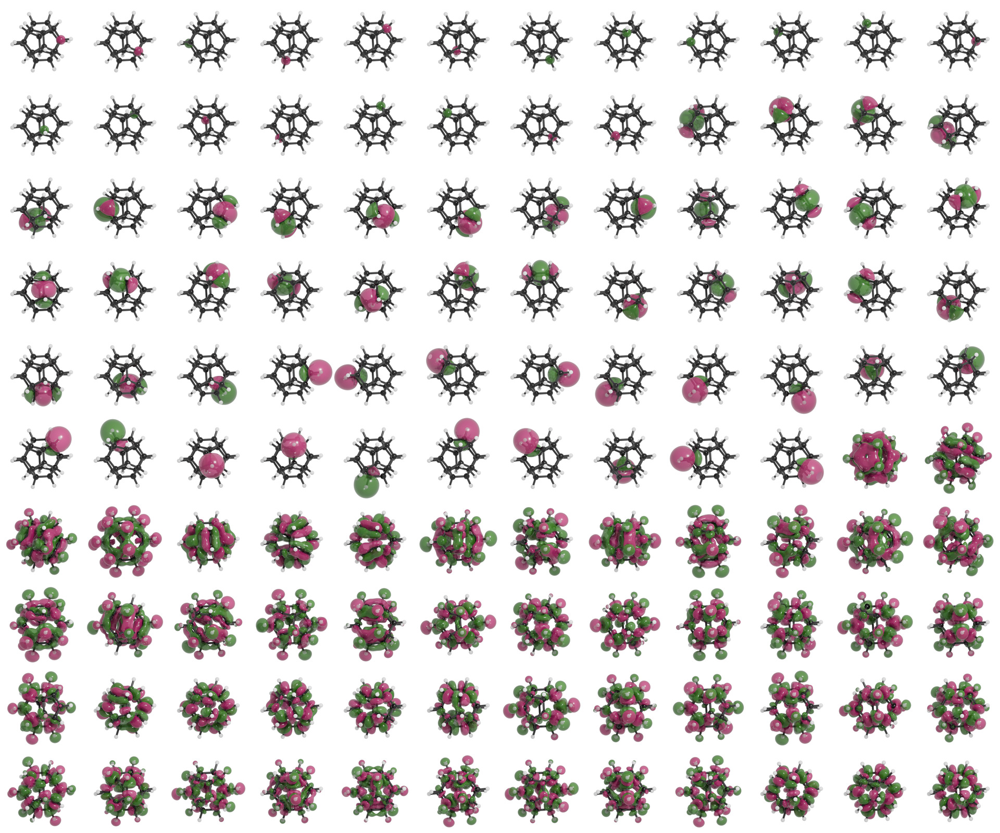

.. index:: gallery

Gallery
=======

    Isosurface visualization of all canonical molecular orbitals of
    methane computed at the Hartree-Fock level using a STO-3G basis set.
    The orbitals are shown as constant-value isosurfaces of the molecular
    wavefunction, illustrating the highly delocalized nature of the canonical
    eigenstates imposed by molecular symmetry.

.. figure:: _static/img/gallery/MO_ch4_FB.jpg

    Isosurface visualization of Foster-Boys localized molecular orbitals of
    methane computed at the Hartree-Fock/STO-3G level. Orbital
    localization transforms the delocalized canonical states into chemically
    intuitive orbitals. For methane, this results in a quadruple degenerate
    set of state corresponding to the equivalent C-H bonds.

    Isosurface visualization of all canonical molecular orbitals of
    carbon monoxide computed at the Hartree-Fock level using a STO-3G basis set.

    Isosurface visualization of Foster-Boys localized molecular orbitals of
    carbon monoxide computed at the Hartree-Fock/STO-3G level. Orbital
    localization transforms the delocalized canonical states into chemically
    intuitive orbitals. For carbon monoxide, we see a threefold degenerate set
    of states correspond to the C-O triple bond.

.. figure:: _static/img/gallery/MO_dodecahedrane_CAN.jpg

    Isosurface visualization of all canonical molecular orbitals of
    dodecahedrane computed at the Hartree-Fock level using a STO-3G basis set.
    The orbitals are shown as constant-value isosurfaces of the molecular
    wavefunction, illustrating the highly delocalized nature of the canonical
    eigenstates imposed by molecular symmetry.

    Isosurface visualization of Foster-Boys localized molecular orbitals of
    dodecahedrane computed at the Hartree-Fock/STO-3G level. Orbital
    localization transforms the delocalized canonical states into chemically
    intuitive orbitals, clearly revealing individual C-C and C-H bonding
    interactions throughout the molecular framework.