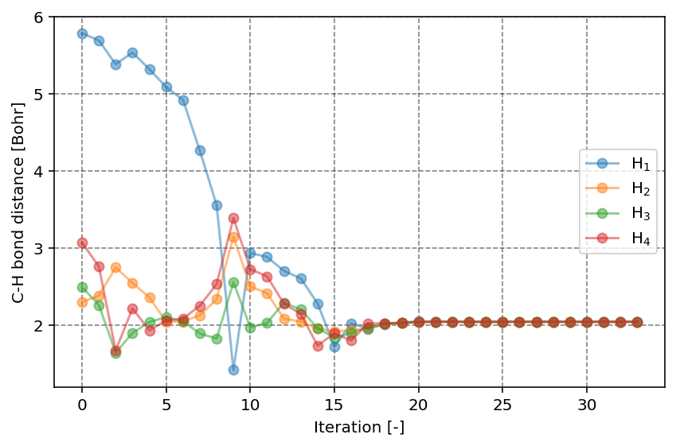

.. index:: geometry-optimization

Geometry optimization
=====================

.. contents:: Table of Contents
    :depth: 3

Performing a geometry optimization
----------------------------------

:program:`PyQInt` is able to perform a geometry optimization of a molecule. It
should however be noted that this functionality is rather limited and essentially
makes use of existing routines available in `Scipy <https://scipy.org/>`_,
specifically the :code:`scipy.optimize.minimize` routine using the
`conjugate gradient <https://docs.scipy.org/doc/scipy/reference/optimize.minimize-cg.html>`_ method.

To demonstrate the procedure, let us consider the CH\ :sub:`4` molecule in a
non-converged geometry wherein the C-H bonds are longer than their optimal
value and where the C molecule does not lie in the middle of the 4 hydrogen
atoms.

Geometry optimization is handled by the :code:`GeometryOptimization` class
which takes a molecule and a basis set as input. The user can indicate whether
they prefer verbose output or not. By default, geometry optimization is *silent*
and does not yield any output.

.. code-block:: python

    from pyqint import GeometryOptimization, Molecule

    mol = Molecule()
    dist = 1.0
    mol.add_atom('C', 0.1, 0.0, 0.1, unit='angstrom')
    mol.add_atom('H', dist, dist, dist, unit='angstrom')
    mol.add_atom('H', -dist, -dist, dist, unit='angstrom')
    mol.add_atom('H', -dist, dist, -dist, unit='angstrom')
    mol.add_atom('H', dist, -dist, -dist, unit='angstrom')

    res = GeometryOptimization(mol, 'sto3g', verbose=True).run()

The output of the above script (condensed) is::

    ################################################################################
    START GEOMETRY OPTIMIZATION (CONJUGATE GRADIENT)
    ################################################################################

    ================================================================================
    GEOMETRY OPTIMIZATION STEP 001
    ================================================================================

    --------------------------------------------------------------------------------
        ENERGIES
    --------------------------------------------------------------------------------

    Kinetic:                      39.25313761
    Nuclear:                     -108.88180088
    Electron-electron repulsion:  28.15082009
    Exchange:                     -6.09926245
    Nuclear repulsion:             8.45508042
    TOTAL:                       -39.12202512

    --------------------------------------------------------------------------------
        POSITIONS AND FORCES
    --------------------------------------------------------------------------------

    C  |   0.100000   0.000000   0.100000 | +1.6500e-02 +2.2923e-04 +1.6500e-02
    H  |   1.000000   1.000000   1.000000 | +4.3454e-02 +5.0855e-02 +4.3454e-02
    H  |  -1.000000  -1.000000   1.000000 | -5.2300e-02 -4.5705e-02 +3.8773e-02
    H  |  -1.000000   1.000000  -1.000000 | -4.6427e-02 +4.0325e-02 -4.6427e-02
    H  |   1.000000  -1.000000  -1.000000 | +3.8773e-02 -4.5705e-02 -5.2300e-02

    Elapsed time: 0.2787 s

    ================================================================================

    ================================================================================
    GEOMETRY OPTIMIZATION STEP 002
    ================================================================================

    --------------------------------------------------------------------------------
        ENERGIES
    --------------------------------------------------------------------------------

    Kinetic:                      39.15432005
    Nuclear:                     -109.64153523
    Electron-electron repulsion:  28.55699241
    Exchange:                     -6.14351258
    Nuclear repulsion:             8.85933154
    TOTAL:                       -39.21440452

    --------------------------------------------------------------------------------
        POSITIONS AND FORCES
    --------------------------------------------------------------------------------

    C  |   0.083500  -0.000229   0.083500 | +1.5463e-02 +6.8533e-04 +1.5463e-02
    H  |   0.956546   0.949145   0.956546 | +4.4324e-02 +5.0368e-02 +4.4324e-02
    H  |  -0.947700  -0.954295   0.961227 | -5.2664e-02 -4.7060e-02 +4.1251e-02
    H  |  -0.953573   0.959675  -0.953573 | -4.8374e-02 +4.3066e-02 -4.8374e-02
    H  |   0.961227  -0.954295  -0.947700 | +4.1251e-02 -4.7060e-02 -5.2664e-02

    Elapsed time: 0.2461 s

    ================================================================================

    ...

    ================================================================================
    GEOMETRY OPTIMIZATION STEP 033
    ================================================================================

    --------------------------------------------------------------------------------
        ENERGIES
    --------------------------------------------------------------------------------

    Kinetic:                      39.46555789
    Nuclear:                     -118.95694319
    Electron-electron repulsion:  32.86550181
    Exchange:                     -6.62307658
    Nuclear repulsion:            13.52209655
    TOTAL:                       -39.72686316

    --------------------------------------------------------------------------------
        POSITIONS AND FORCES
    --------------------------------------------------------------------------------

    C  |   0.019995   0.000002   0.019995 | +3.4887e-06 +2.7088e-06 +3.4885e-06
    H  |   0.645172   0.625454   0.645172 | -3.0848e-06 -5.6713e-06 -3.0848e-06
    H  |  -0.605171  -0.625272   0.645388 | +4.1945e-07 -6.8789e-08 +2.2218e-06
    H  |  -0.605385   0.625087  -0.605385 | -3.0450e-06 +3.1000e-06 -3.0450e-06
    H  |   0.645388  -0.625272  -0.605171 | +2.2217e-06 -6.8771e-08 +4.1955e-07

    Elapsed time: 0.2467 s

    ================================================================================

    ================================================================================
    GEOMETRY OPTIMIZATION STEP 034
    ================================================================================

    --------------------------------------------------------------------------------
        ENERGIES
    --------------------------------------------------------------------------------

    Kinetic:                      39.46555331
    Nuclear:                     -118.95690650
    Electron-electron repulsion:  32.86548664
    Exchange:                     -6.62307497
    Nuclear repulsion:            13.52207800
    TOTAL:                       -39.72686370

    --------------------------------------------------------------------------------
        POSITIONS AND FORCES
    --------------------------------------------------------------------------------

    C  |   0.019993   0.000002   0.019993 | +1.1853e-06 +1.5988e-06 +1.1850e-06
    H  |   0.645174   0.625454   0.645174 | -1.6340e-06 -4.6101e-06 -1.6340e-06
    H  |  -0.605170  -0.625272   0.645390 | +5.5012e-07 -1.2756e-07 +2.7956e-06
    H  |  -0.605386   0.625089  -0.605386 | -2.8970e-06 +3.2663e-06 -2.8970e-06
    H  |   0.645390  -0.625272  -0.605170 | +2.7956e-06 -1.2747e-07 +5.5023e-07

    Elapsed time: 0.2813 s

    ================================================================================

Result dictionary of a geometry optimization
--------------------------------------------

The result of a Geometry Optimization calculation is captured inside a dictionary
object. This dictionary objects contains the following keys

.. list-table:: Description of the data contained in the result library
   :widths: 25 75
   :header-rows: 1

   * - Key
     - Description
   * - :code:`res_opt`
     - :code:`OptimizeResult` object from the scipy routine. For more information, please consult the `documentation <https://docs.scipy.org/doc/scipy/reference/generated/scipy.optimize.minimize.html#scipy.optimize.minimize>`_.
   * - :code:`energies`
     - List of the total electronic energy at each ionic step.
   * - :code:`forces`
     - List of the forces on all the atoms at each ionic step.
   * - :code:`coordinates`
     - Coordinates of the atoms at each ionic step.
   * - :code:`data`
     - Result dictionary of the Hartree-Fock calculation **last** ionic step.
   * - :code:`mol`
     - Molecule on which the geometry optimization acted.

To demonstrate the use of the above data, consider the script as shown below.
In this script, we generate a CH\ :sub:`4` in a (highly) perturbed configuration.
The perturbed configuration is generated using a random number generator (RNG). For
reproduction purposes, we have seeded this RNG such that the result as shown
below can be easily reproduced. The result of the geometry optimization is
captured in the :code:`res` variable which is a dictionary according to the
above-mentioned specifications.

To show how the contents of this dictionary can be used, we produce two plots
which are explained below.

.. code-block:: python

    from pyqint import GeometryOptimization, Molecule
    import matplotlib.pyplot as plt
    import numpy as np

    # seed the random number generator to yield reproducible result
    np.random.seed(4)

    # build a CH4 molecule where the atom positions are perturbed based on a
    # random number generator
    mol = Molecule()
    dist = 1.0
    mol.add_atom('C', 0.1, 0.0, 0.1, unit='angstrom')
    mol.add_atom('H', dist + np.random.rand(),
                      dist + np.random.rand(),
                      dist + np.random.rand(),
                      unit='angstrom')
    mol.add_atom('H', -dist + np.random.rand(),
                      -dist + np.random.rand(),
                      dist + np.random.rand(),
                      unit='angstrom')
    mol.add_atom('H', -dist + np.random.rand(),
                      dist + np.random.rand(),
                      -dist + np.random.rand(),
                      unit='angstrom')
    mol.add_atom('H', dist + np.random.rand(),
                      -dist + np.random.rand(),
                      -dist + np.random.rand(),
                      unit='angstrom')

    # perform the geometry optimization
    res = GeometryOptimization(verbose=False).run(mol, 'sto3g')

    # collect the RMS of the force
    rms = np.zeros(len(res['coordinates']))
    for i in range(len(res['coordinates'])):
        forces = res['forces'][i]
        rms[i] = np.sqrt(np.sum(np.linalg.norm(forces, axis=0) / float(len(forces))))

    # plot electronic energy and RMS of the force
    fig, ax1 = plt.subplots(dpi=144, figsize=(6,4))
    ax1.plot(res['energies'], '-o', color='black')
    ax2 = plt.twinx()
    ax2.plot(rms, '-o', color='red')
    ax2.set_ylabel('Root-mean-square force')
    ax2.tick_params(axis='y', colors='red')
    ax2.yaxis.label.set_color('red')
    ax2.spines['right'].set_color('red')
    ax1.grid(linestyle='--', color='black', alpha=0.5)
    ax1.set_xlabel('Iteration [-]')
    ax1.set_ylabel('Electronic energy [Ht]')
    plt.tight_layout()
    plt.show()

    # show convergence of C-H bond distances for all bonds
    # collect data
    distances = np.zeros((4, len(res['coordinates'])))
    for i in range(0,4):
        for j in range(0, len(res['coordinates'])):
            coord = res['coordinates'][j]
            distances[i,j] = np.linalg.norm(coord[i+1] - coord[0])

    # plot in a figure
    plt.figure(dpi=144, figsize=(6,4))
    for i in range(0,4):
        plt.plot(distances[i,:], '-o', alpha=0.5, label='H$_{%i}$' % (i+1))
    plt.grid(linestyle='--', color='black', alpha=0.5)
    plt.xlabel('Iteration [-]')
    plt.ylabel('C-H bond distance [Bohr]')
    plt.legend(loc='right')
    plt.tight_layout()
    plt.show()

The result of the above script are the following two images, showcasing the
optimization procedure and an example application of the data in the result dictionary.
The first figure shows the total electronic energy and the root-mean-square
of the force as function of the iteration number. The convergence criterion
is essentially such that these forces need to be smaller than a threshold
value. From the figure, it is clear that the total electronic energy converges
faster than the forces.

.. figure:: _static/img/ch4_geomopt_energy_rms_force.png

    Energy and root-mean-square of the forces as function of the iteration number.

In the second figure, we can observe the C-H bond distance as function of the
iteration number. Clearly, we start at a relatively unfavorable geometry where
one of the H atoms is quite distanced from the central C atom. With increasing
iteration, we can however readily see that all C-H bond distances converge
to the same value, as expected for the highly symmetric CH\ :sub:`4` molecule.

    C-H bond distances as function of the iteration number.

.. danger::
    It is by no means guaranteed that a geometry optimization converges. Even
    more important, when the geometry optimization has not converged, it is
    also highly likely that the underlying electronic structure calculation
    has not been properly converged as well. One should absolutely distrust
    any result coming out of such a calculation.

    **Always verify that a calculation is properly converged before using
    its output.**