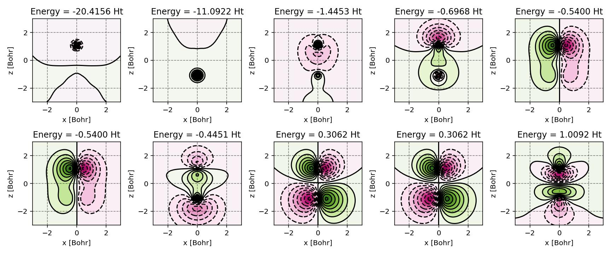

PyQInt: a Python package for evaluating Gaussian integrals and performing electronic structure calculations
===========================================================================================================

.. image:: https://jose.theoj.org/papers/2a73fa24200e8c1ec47fc6e37f818a54/status.svg
   :target: https://jose.theoj.org/papers/2a73fa24200e8c1ec47fc6e37f818a54
   :alt: status
.. image:: https://img.shields.io/github/v/tag/ifilot/pyqint?label=version
   :alt: GitHub tag (latest SemVer)
.. image:: https://github.com/ifilot/pyqint/actions/workflows/build_wheels.yml/badge.svg
   :target: https://github.com/ifilot/pyqint/actions/workflows/build_wheels.yml
.. image:: https://img.shields.io/badge/License-GPLv3-blue.svg
   :target: https://www.gnu.org/licenses/gpl-3.0

:program:`PyQInt` is a Python-based, teaching-oriented implementation of the
Hartree-Fock method, designed to make the inner workings of electronic structure
theory accessible and transparent. It provides a clear, readable interface to
fundamental components such as molecular integrals over Gaussian basis
functions, SCF procedures (with DIIS acceleration), orbital localization, and
geometry optimization.

What sets :program:`PyQInt` apart is its educational design philosophy: all
matrices, intermediate results, and algorithmic steps are exposed—allowing
students, educators, and developers to inspect, understand, and experiment with
every part of the computation. Whether you are learning how Hartree-Fock works,
developing your own extensions, or teaching a course in computational chemistry,
PyQInt offers a hands-on, exploratory platform.

.. admonition:: Tip

   For students interested in the theoretical foundations and algorithmic
   implementation of Hartree–Fock, we recommend the open-access textbook Elements
   of `Electronic Structure Theory <https://ifilot.pages.tue.nl/elements-of-electronic-structure-theory/index.html>`_.

:program:`PyQInt` offers supporting scripts for facile visualization of result
such as producing contour plots for the molecular orbitals. Below, an example
is shown for the molecular orbitals of the CO molecule.

    Canonical molecular orbitals of CO visualized using contour plots.

:program:`PyQInt` not only supports calculation of the canonical molecular orbitals
via the (restricted) Hartee-Fock procedure, but can also be used to construct
the localized molecular orbitals which is relevant for showing the similarity
between modern electronic structure methods and classical Lewis theory. In the
image below, one can observe the **canonical** molecular orbitals for the CO molecule
as well as the **localized** molecular orbitals.

    Canonical molecular orbitals of CO visualized using isosurfaces with an
    isovalue of +/-0.03.

    Localized molecular orbitals of CO visualized using isosurfaces with an
    isovalue of +/-0.03. Note that the localization procedure has only been
    applied to the occupied molecular orbitals. Observe that the localized
    orbitals contain a triple-degenerate state corresponding to the triple
    bond and two lone pairs for C and O.

:program:`PyQInt` has been developed at the Eindhoven University of Technology,
Netherlands. :program:`PyQInt` and its development are hosted on `github
<https://github.com/ifilot/pyqint>`_.  Bugs and feature
requests are ideally submitted via the `github issue tracker
<https://github.com/ifilot/pyqint/issues>`_.

.. toctree::
   :maxdepth: 3
   :caption: Contents:

   installation
   basis_functions
   integral_evaluation
   basis_sets_and_molecules
   electronic_structure_calculations
   molecular_orbital_diagrams
   orbital_visualization
   orbital_localization
   matrix_visualization
   geometry_optimization
   population_analysis
   symmetry_adapted_basis
   acceleration_routines
   integrator
   gallery
   community_guidelines

Indices and tables
------------------

* :ref:`genindex`
* :ref:`search`
