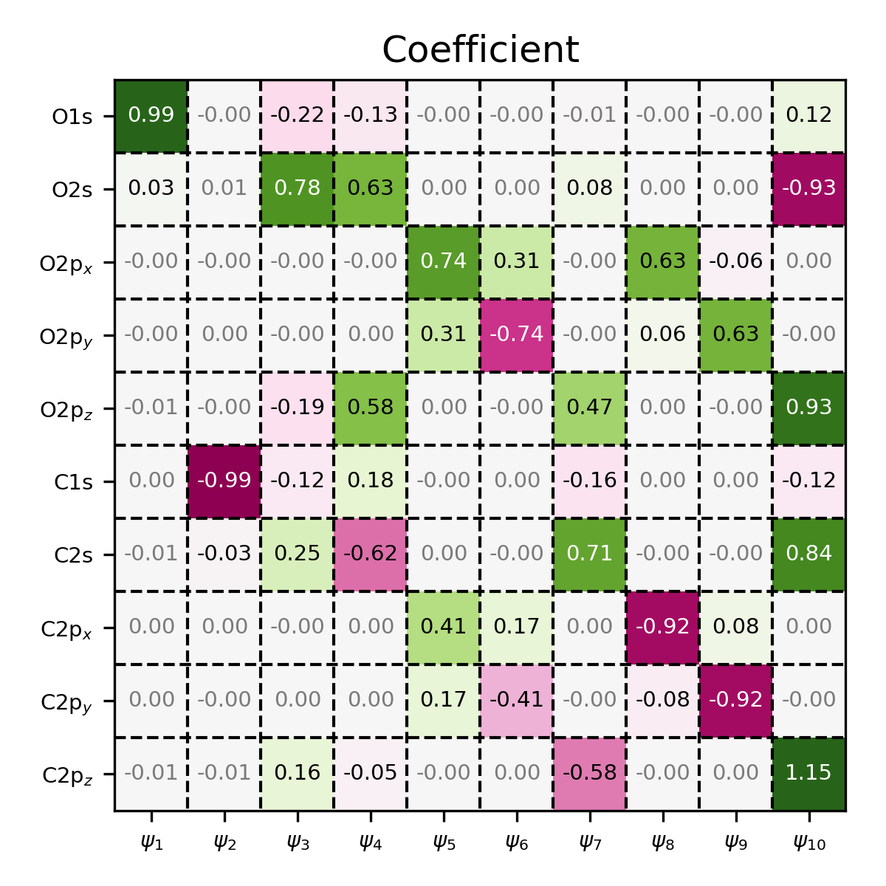

Matrix visualization
====================

Many quantities encountered in electronic-structure theory are naturally
represented as matrices, such as overlap matrices, Fock matrices, or molecular
orbital coefficient matrices. To facilitate the inspection and interpretation
of such data, :program:`PyQInt` provides the :code:`MatrixPlotter` helper class.

The :code:`MatrixPlotter` is intentionally stateless and offers a compact
interface for visualizing square matrices as annotated heatmaps. Each matrix
element is displayed both by color and by its numerical value, making the
structure and magnitude of matrix elements immediately apparent.

Atomic orbital labeling
-----------------------

For chemically meaningful matrix plots, it is often desirable to label rows and
columns using atomic orbital (AO) labels. Since AO labels cannot be inferred
unambiguously from contracted Gaussian functions alone, the
:code:`MatrixPlotter` provides a helper routine (:code:`generate_ao_labels`) for
generating AO labels from an explicit shell specification.

AO labels are generated by providing for each atom its element symbol and the
list of shells that should be included. The shell specification explicitly
defines the principal quantum number and angular momentum and avoids any
ambiguity associated with multiple shells of identical angular momentum.

.. code:: python

    # example to generate AO labels for CO
    labels = MatrixPlotter.generate_ao_labels([
        ('O', ('1s', '2s', '2p')),
        ('C', ('1s', '2s', '2p')),
    ])

Example: overlap, Fock, and coefficient matrices of CO
-------------------------------------------------------

The following example demonstrates how to visualize the overlap matrix, Fock
matrix, and molecular orbital coefficient matrix of carbon monoxide (CO)
computed at the Hartree–Fock/STO-3G level.

.. code-block:: python

    from pyqint import MoleculeBuilder, HF, MatrixPlotter

    def main():
        mol = MoleculeBuilder().from_name('CO')
        res = HF(mol, 'sto3g').rhf(verbose=False)
        
        labels = MatrixPlotter.generate_ao_labels([
            ('O', ('1s', '2s', '2p')),
            ('C', ('1s', '2s', '2p')),
        ])
        
        MatrixPlotter.plot_matrix(
            mat=res['overlap'],
            filename='overlap-co.png',
            xlabels=labels,
            ylabels=labels,
            xlabelrot=0,
            title='Overlap',
        )

        MatrixPlotter.plot_matrix(
            mat=res['fock'],
            filename='fock-co.png',
            xlabels=labels,
            ylabels=labels,
            xlabelrot=0,
            title='Fock',
        )

        MatrixPlotter.plot_matrix(
            mat=res['orbc'],
            filename='coefficient-co.png',
            xlabels=[r'$\psi_{%i}$' % (i+1) for i in range(len(res['cgfs']))],
            ylabels=labels,
            xlabelrot=0,
            title='Coefficient',
        )

    if __name__ == '__main__':
        main()

In this example:

- The overlap and Fock matrices are visualized using AO labels on both axes.
- The molecular orbital coefficient matrix is visualized with atomic orbitals
  along the rows and molecular orbitals along the columns.
- The figure size is determined automatically from the matrix dimension, while
  the output filename is specified explicitly for each plot.

.. figure:: _static/img/overlap-co.png

    Overlap matrix of CO, visualized using the :code:`MatrixPlotter` class.
    Note that the entries on the diagonal are all equal to one, indicating
    that the basis set is normalized. Also note that because of the symmetry 
    of the molecule, certain elements of the matrix are equal to zero.

.. figure:: _static/img/fock-co.png

    Fock matrix of CO, visualized using the :code:`MatrixPlotter` class. Observe
    that the first and sixth diagonal element have significantly lower energies,
    indicating that these basis functions correspond to core atomic orbitals.
    Also note that because of the symmetry of the molecule, certain elements
    of the matrix are equal to zero, similar to the overlap matrix.

    Coefficient matrix of CO, visualized using the :code:`MatrixPlotter` class.

Highlighting elements
---------------------

In some cases, it is useful not only to visualize a matrix, but also to
emphasize specific elements or regions within it. This can be achieved using
the ``boxes`` argument.

The ``boxes`` argument expects a list of 5-tuples. Each tuple defines a
rectangular region and consists of the following elements, in order:

- the starting x-coordinate
- the starting y-coordinate
- the width of the rectangle
- the height of the rectangle
- the color of the rectangle

The example below demonstrates how to draw red, green, and blue rectangles on
top of a matrix visualization.

.. code-block:: python

    from pyqint import MoleculeBuilder, HF, MatrixPlotter

    def main():
        mol = MoleculeBuilder().from_name('CO')
        res = HF(mol, 'sto3g').rhf(verbose=False)

        labels = MatrixPlotter.generate_ao_labels([
            ('O', ('1s', '2s', '2p')),
            ('C', ('1s', '2s', '2p')),
        ])

        # highlighting boxes
        boxes = [
            (0,0,1,1,'#BB0000'),
            (1,2,3,1,'#00BB00'),
            (3,4,1,3,'#0000BB'),
        ]

        MatrixPlotter.plot_matrix(
            mat=res['overlap'],
            filename='overlap-co.png',
            xlabels=labels,
            ylabels=labels,
            xlabelrot=0,
            title='Overlap',
            boxes=boxes
        )

    if __name__ == '__main__':
        main()

.. figure:: _static/img/overlap-co-boxes.png

    Coefficient matrix of CO, visualized using the :code:`MatrixPlotter` class,
    where a number of elements have been highlighted.

.. note::

    The ``(x, y)`` coordinates use **zero-based indexing**. Consequently, the
    top-left corner of the first box is specified as ``(0, 0)``.