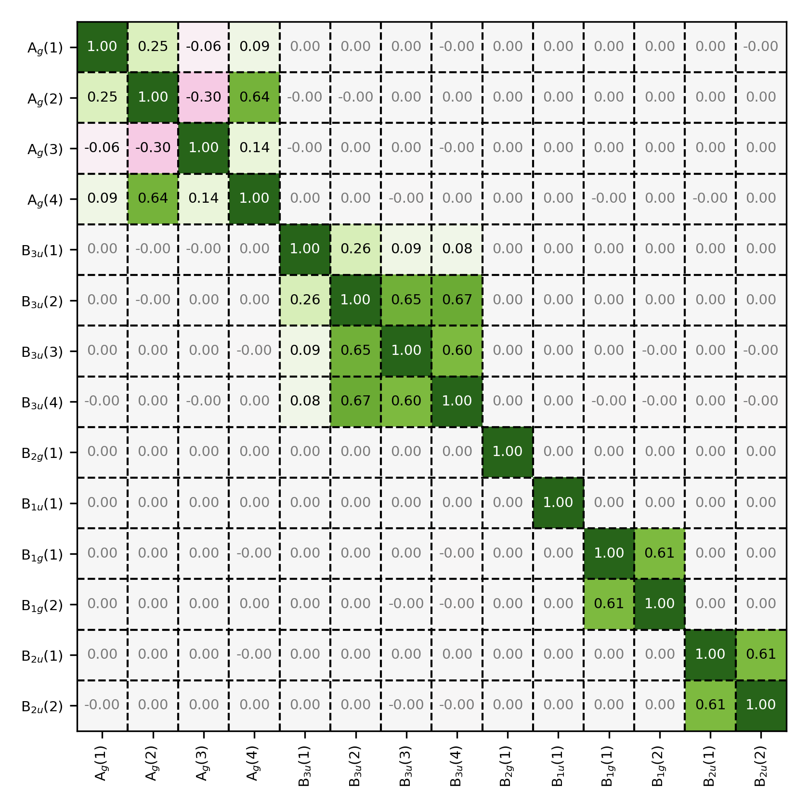
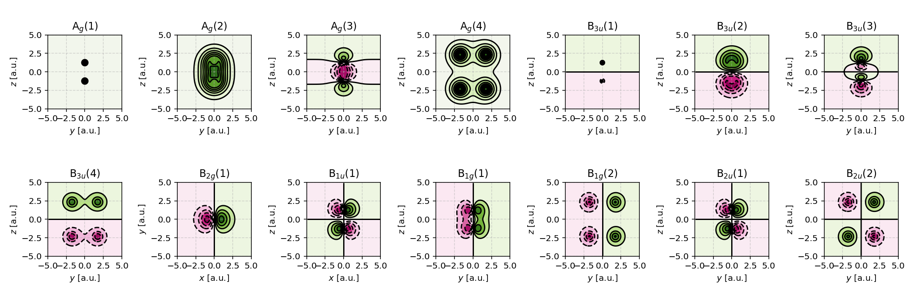
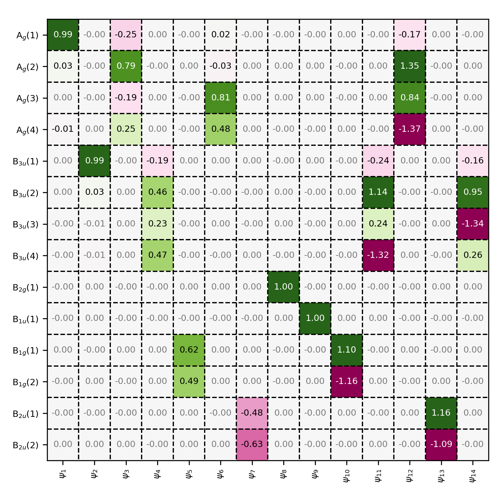

Symmetry-adapted basis sets
===========================

.. contents:: Table of Contents
   :depth: 3

This page describes an advanced workflow: constructing a *symmetry-adapted*
atomic-orbital basis (often called **SALCs**, symmetry-adapted linear
combinations) and using it to transform matrices such as the overlap and Fock
matrix into a **block-diagonal form** (one block per irreducible representation).

Why do this?
------------

For molecules with non-trivial point-group symmetry, a symmetry-adapted basis
can be used to:

- reveal the symmetry structure of the AO space,
- produce block-diagonal matrices (overlap, Fock, density),
- reduce computational cost by working per symmetry block,
- obtain orbitals that already carry irrep labels.

In :program:`PyQInt`, the Hartree-Fock driver operates on atom-centered basis
functions defined by the basis-set files. For advanced symmetry workflows, it is
often useful to:

1. run a standard Hartree-Fock calculation to obtain matrices in the AO basis,
2. build a symmetry-adapted transformation matrix :math:`\mathbf{B}`,
3. transform matrices into the symmetry basis,
4. optionally reorder the symmetry basis to group irreps into consecutive blocks,
5. construct and visualize the resulting SALC basis functions.

.. note::

   The example below focuses on (i) constructing SALCs and (ii) transforming
   matrices into a symmetry basis. A full SCF implementation *in the symmetry
   basis* (i.e. performing the SCF iterations per symmetry block) is a natural
   extension, but is not currently exposed as a separate high-level workflow.

Ethylene example
----------------

The script below demonstrates the construction of symmetry-adapted basis
functions for ethylene, the transformation of the overlap matrix, and the
visualization of the resulting SALCs.

.. code-block:: python

    import numpy as np

    from pyqint import (
        MoleculeBuilder,
        HF,
        PyQInt,
        CGF,
        MatrixPlotter,
        ContourPlotter,
    )

    def main():
        # --------------------------------------------------------------------------
        # 1) Build the overlap matrix explicitly in the original AO basis
        # --------------------------------------------------------------------------
        mol = MoleculeBuilder.from_name("ethylene")
        cgfs, nuclei = mol.build_basis('sto3g')

        integrator = PyQInt()
        N = len(cgfs)
        S_ao = np.empty((N, N))

        for i in range(N):
            for j in range(i, N):
                S_ao[i, j] = S_ao[j, i] = integrator.overlap(cgfs[i], cgfs[j])

        # --------------------------------------------------------------------------
        # 2) Build an example symmetry-adaptation transformation B
        #    (This matrix is molecule- and AO-ordering-specific.)
        # --------------------------------------------------------------------------
        # Ethylene STO-3G yields 14 basis functions in this setup.
        B = np.zeros((14, 14))

        # Manally construct the SALCs (this is based on group theory)
        for i in range(0, 5):
            B[i * 2, i] = 1.0
            B[i * 2, i + 7] = 1.0
            B[i * 2 + 1, i] = 1.0
            B[i * 2 + 1, i + 7] = -1.0

        B[10, 5] = 1.0
        B[10, 6] = 1.0
        B[10, -2] = 1.0
        B[10, -1] = 1.0

        B[11, 5] = 1.0
        B[11, 6] = -1.0
        B[11, -2] = 1.0
        B[11, -1] = -1.0

        B[12, 5] = 1.0
        B[12, 6] = 1.0
        B[12, -2] = -1.0
        B[12, -1] = -1.0

        B[13, 5] = 1.0
        B[13, 6] = -1.0
        B[13, -2] = -1.0
        B[13, -1] = 1.0

        # --------------------------------------------------------------------------
        # 3) Transform the overlap matrix to the SALC basis:
        # --------------------------------------------------------------------------
        S_salc = B @ S_ao @ B.T

        # --------------------------------------------------------------------------
        # 4) Reorder SALCs so functions belonging to the same
        #    irreducible representation become consecutive,
        #    yielding block-diagonal matrices
        #
        #    A simple heuristic is used here: indices are grouped
        #    based on significant overlap matrix elements
        # --------------------------------------------------------------------------
        order = []
        for i in range(S_salc.shape[0]):
            for j in range(S_salc.shape[1]):
                if abs(S_salc[i, j]) > 0.1 and j not in order:
                    order.append(j)

        P = np.zeros((len(order), len(order)), dtype=int)
        P[np.arange(len(order)), order] = 1
        B_blk = P @ B # construct block-diagonalized basis matrix

        # --------------------------------------------------------------------------
        # 5) Construct symmetry-adapted basis functions (SALCs)
        #    as new CGFs and perform a Hartree–Fock calculation
        #    directly in the SALC basis
        # --------------------------------------------------------------------------
        cgfs_salc = build_salcs_from_transform(cgfs, B_blk, integrator)
        res_salc = HF(mol, cgfs_salc).rhf(verbose=True)

        # --------------------------------------------------------------------------
        # 6) Define labels for symmetry blocks
        # --------------------------------------------------------------------------
        symfuncs = {
            r"A$_{g}$":  4,
            r"B$_{3u}$": 4,
            r"B$_{2g}$": 1,
            r"B$_{1u}$": 1,
            r"B$_{1g}$": 2,
            r"B$_{2u}$": 2,
        }

        symlabels = []
        for k, v in symfuncs.items():
            for i in range(v):
                symlabels.append(f"{k}({i+1})")

        # --------------------------------------------------------------------------
        # 7) Visualize block-structured matrices in the SALC basis
        # --------------------------------------------------------------------------
        # plot overlap matrix
        MatrixPlotter.plot_matrix(
            mat=res_salc['overlap'],
            filename="ethylene_overlap_salc.png",
            xlabels=symlabels,
            ylabels=symlabels,
            xlabelrot=90,
        )

        # plot fock matrix
        MatrixPlotter.plot_matrix(
            mat=res_salc['fock'],
            filename="ethylene_fock_salc.png",
            xlabels=symlabels,
            ylabels=symlabels,
            xlabelrot=90,
        )

        # plot coefficient matrix
        MatrixPlotter.plot_matrix(
            mat=res_salc['orbc'],
            filename="ethylene_coefficient_salc.png",
            xlabels=[r'$\psi_{%i}$' % (i+1) for i in range(len(res_salc['cgfs']))],
            ylabels=symlabels,
            xlabelrot=90,
        )

        # --------------------------------------------------------------------------
        # 8) Visualize symmetry-adapted basis functions (SALCs)
        #    as real-space contour plots
        # --------------------------------------------------------------------------
        ContourPlotter.build_contourplot(
            res=res_salc,
            filename="ethylene_salcs_yz.png",
            plane="yz",
            sz=5.0,
            npts=101,
            nrows=2,
            ncols=7,
            labels=symlabels,
        )

    def build_salcs_from_transform(
        cgfs_ao,
        B: np.ndarray,
        integrator: PyQInt,
        threshold: float = 1e-2,
    ):
        """
        Construct SALC basis functions as CGFs using a linear transformation B.

        Each SALC is a linear combination of AO CGFs. Since the contributing AO
        primitives live on different atomic centers, primitives must be added
        with explicit positions using `add_gto_with_position`.

        The resulting SALCs are normalized individually.
        """
        n = B.shape[0]
        cgfs_salc = [CGF([0.0, 0.0, 0.0]) for _ in range(n)]

        for i in range(n):                 # new basis function index
            for j in range(len(cgfs_ao)):  # old AO basis function index
                w = float(B[i, j])
                if abs(w) < threshold:
                    continue

                # Add all primitives of AO function j into SALC i
                for g in cgfs_ao[j].gtos:
                    cgfs_salc[i].add_gto_with_position(
                        g.c * w,
                        g.p,
                        g.alpha,
                        g.l,
                        g.m,
                        g.n,
                    )

            # Normalize SALC i: χ ← χ / sqrt(<χ|χ>)
            s_ii = integrator.overlap(cgfs_salc[i], cgfs_salc[i])
            norm = float(np.sqrt(s_ii))
            for g in cgfs_salc[i].gtos:
                g.c /= norm

        return cgfs_salc

    if __name__ == "__main__":
        main()

Results for ethylene
--------------------

    Overlap matrix in the symmetry-adapted basis. Observe that the overlap
    matrix has a block-diagonal structures, showing that the basis functions
    only overlap with other basis functions belonging to the same symmetry
    group.

    Contour plots of the symmetry adapted basis set. Note that the B3u and
    B2u basis functions constitute 2px orbitals are therefore cannot be
    visualized via a projection onto the :math:`yz`-plane.

.. figure:: _static/img/ethylene_fock_salc.png

    Fock matrix in the symmetry-adapted basis. Observe that the Fock matrix
    also has a block-diagonal structure.

    Coefficient matrix in the symmetry-adapted basis. All molecular orbitals are
    constructed from basis functions that belong to the same symmetry group.

.. note::

    - The transformation matrix :math:`\mathbf{B}` is **system- and ordering-dependent**.
      In production workflows it is typically derived from the character table and
      projection operators for the molecule's point group.

    - SALC construction requires combining primitives centered on different atoms.
      For this reason, the code uses :code:`CGF.add_gto_with_position` when building
      the new contracted functions. During integral evaluation, the **GTO centers**
      are used, not the position stored in the CGF object itself.

    - The reordering step uses a simple heuristic based on the transformed overlap
      matrix. For rigorous work, irrep assignment should be based on the explicit
      symmetry operations of the point group.