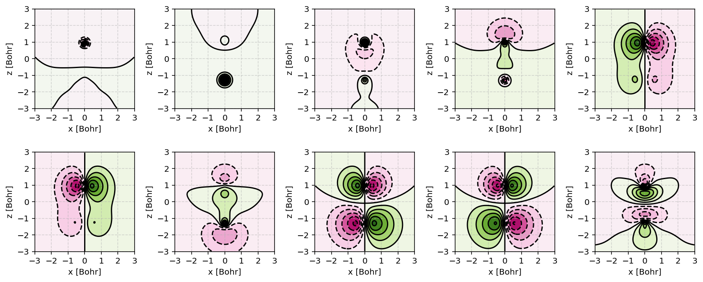
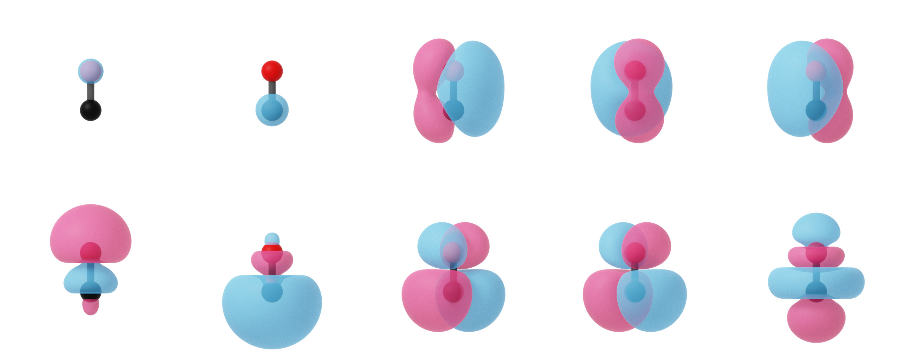

.. _user-interface:
.. index:: userinterface

User Interface
##############

.. contents:: Table of Contents
    :depth: 3

Basis functions
===============

Gaussian type orbitals (GTO)
----------------------------

:program:`PyQInt` uses cartesian Gaussian type orbitals as given by

.. math::

    \Phi(\alpha,l,m,n,\vec{R}) = N (x - X)^{l} (y - Y)^{m} (z - Z)^{n} \exp \left(- \alpha |\vec{r} - \vec{R}|^{2} \right)

wherein :math:`\alpha` is the exponent, :math:`\vec{R} = \left(X,Y,Z\right)` the
position of the orbital, :math:`(l,m,n)` the orders of the pre-exponential
polynomial, and :math:`N` a normalization constant such that

.. math::

    \left< \Phi | \Phi \right> = 1

.. note::
    The normalization constant is automatically calculated by `PyQInt` based
    on the value of :math:`\alpha` and :math:`(l,m,n)` and does not have
    to be supplied by the user.

GTOs are a fundamental building block of CGF (see below) and typically a user would
not directly work with them. Nevertheless, GTO objects can be constructed as follows::

    from pyqint import PyQInt, CGF, GTO

    coeff = 1.0    # coefficients only have meaning for GTOs within a CGF
    alpha = 0.5
    l,m,n = 0,0,0
    p = (0,0,0)
    G = GTO(coeff, p, alpha, l, m, n)

.. note::
    If you work with individual GTOs, the first parameter to construct the GTO
    should have a value of 1.0. This first parameter corresponds to the linear
    expansion coefficient used in the formulation of Contracted Gaussian Functions
    (see below).

Contracted Gaussian Functions (CGF)
-----------------------------------

Several GTOs can be combined to produce a so-called Contracted Gaussian Functional which
is esentially a linear combination of GTOs as given by

.. math::

    \phi = \sum_{i} c_{i} \Phi_{i}(\alpha,l,m,n,\vec{R})

To build a CGF, we first have to produce the CGF object and then
add GTOs to it::

    from pyqint import PyQInt, CGF

    cgf = CGF([0.0, 0.0, 0.0])

    cgf.add_gto(0.154329, 3.425251, 0, 0, 0)
    cgf.add_gto(0.535328, 0.623914, 0, 0, 0)
    cgf.add_gto(0.444635, 0.168855, 0, 0, 0)

.. note::
    The first argument of the :code:`add_gto` function is the linear expansion coefficient
    :math:`c_{i}` and the second argument is :math:`\alpha`.

Integral evaluation
===================

Electronic structure calculations require the construction of molecular
integrals. Here, an overview is given of the integrals involved and how these
can be evaluated using :program:`PyQInt`.

Overlap integrals
-----------------

Overlap integrals effectively probe the overlap between two CGFs and are given by

.. math::

    S_{ij} = \left< \phi_{i} | \phi_{j} \right>

CGFs should be normalized and as such, their self-overlap should be equal to
1. In the code snippet below, the overlap matrix :math:`\mathbf{S}` is
calculated for a basis set composed of the two :math:`1s` atomic orbitals on H which
are separated by a distance of 1.4 Bohr.

.. code-block:: python

    from pyqint import PyQInt, CGF
    import numpy as np
    from copy import deepcopy

    # construct integrator object
    integrator = PyQInt()

    # build CGF for a H atom located at the origin
    cgf1 = CGF([0.0, 0.0, 0.0])

    cgf1.add_gto(0.154329, 3.425251, 0, 0, 0)
    cgf1.add_gto(0.535328, 0.623914, 0, 0, 0)
    cgf1.add_gto(0.444635, 0.168855, 0, 0, 0)

    # create a copy of the CGF located 1.4 a.u. separated from CGF1
    cgf2 = deepcopy(cgf1)
    cgf2.p[2] = 1.4

    # construct empty matrix
    S = np.zeros((2,2))
    S[0,0] = integrator.overlap(cgf1, cgf1)
    S[0,1] = S[1,0] = integrator.overlap(cgf1, cgf2)
    S[1,1] = integrator.overlap(cgf2, cgf2)

    # output result
    print(S)

The result of this script is::

    [[1.00000011 0.6593185 ]
     [0.6593185  1.00000011]]

Kinetic integrals
-----------------

Kinetic integrals determine the kinetic energy of a given orbital and are given
by

.. math::

    T_{ij} = \left< \phi_{i} \left| -\frac{1}{2} \nabla^{2} \right| \phi_{j} \right>

In the code snippet below, the kinetic energy matrix :math:`\mathbf{T}` is
calculated for a basis set composed of the two :math:`1s` atomic orbitals on H which
are separated by a distance of 1.4 Bohr.

.. code-block:: python

    from pyqint import PyQInt, CGF
    import numpy as np
    from copy import deepcopy

    # construct integrator object
    integrator = PyQInt()

    # build CGF for a H atom located at the origin
    cgf1 = CGF([0.0, 0.0, 0.0])

    cgf1.add_gto(0.154329, 3.425251, 0, 0, 0)
    cgf1.add_gto(0.535328, 0.623914, 0, 0, 0)
    cgf1.add_gto(0.444635, 0.168855, 0, 0, 0)

    # create a copy of the CGF located 1.4 a.u. separated from CGF1
    cgf2 = deepcopy(cgf1)
    cgf2.p[2] = 1.4

    # construct empty matrix
    T = np.zeros((2,2))
    T[0,0] = integrator.kinetic(cgf1, cgf1)
    T[0,1] = T[1,0] = integrator.kinetic(cgf1, cgf2)
    T[1,1] = integrator.kinetic(cgf2, cgf2)

    # output result
    print(T)

The result of the above script is::

    [[0.76003161 0.23645446]
     [0.23645446 0.76003161]]

Nuclear attraction integrals
----------------------------

Nuclear attraction integrals determine the attraction between a given nucleus
and the atomic orbital and are given by

.. math::

    V_{ij} = \left< \phi_{i} \left| -\frac{Z_{c}}{r_{i,c}} \right| \phi_{j} \right>

In the code snippet below, the nuclear attraction energy matrices :math:`\mathbf{V}_{1}`
and :math:`\mathbf{V}_{2}` are calculated for a basis set composed of the
two :math:`1s` atomic orbitals on H which are separated by a distance of 1.4 Bohr.
Due to the symmetry of the system, the nuclear attraction matrices for each of
the nuclei are the same.

.. code-block:: python

    from pyqint import PyQInt, CGF
    import numpy as np
    from copy import deepcopy

    # construct integrator object
    integrator = PyQInt()

    # build CGF for a H atom located at the origin
    cgf1 = CGF([0.0, 0.0, 0.0])

    cgf1.add_gto(0.154329, 3.425251, 0, 0, 0)
    cgf1.add_gto(0.535328, 0.623914, 0, 0, 0)
    cgf1.add_gto(0.444635, 0.168855, 0, 0, 0)

    # create a copy of the CGF located 1.4 a.u. separated from CGF1
    cgf2 = deepcopy(cgf1)
    cgf2.p[2] = 1.4

    # Build nuclear attraction integrals
    V1 = np.zeros((2,2))
    V1[0,0] = integrator.nuclear(cgf1, cgf1, cgf1.p, 1)
    V1[0,1] = V1[1,0] = integrator.nuclear(cgf1, cgf2, cgf1.p, 1)
    V1[1,1] = integrator.nuclear(cgf2, cgf2, cgf1.p, 1)

    V2 = np.zeros((2,2))
    V2[0,0] = integrator.nuclear(cgf1, cgf1, cgf2.p, 1)
    V2[0,1] = V2[1,0] = integrator.nuclear(cgf1, cgf2, cgf2.p, 1)
    V2[1,1] = integrator.nuclear(cgf2, cgf2, cgf2.p, 1)

    # print result
    print(V1)
    print(V2)

The result of the above script is::

    [[-1.22661358 -0.59741732]
     [-0.59741732 -0.6538271 ]]
    [[-0.6538271  -0.59741732]
     [-0.59741732 -1.22661358]]

Two-electron integrals
----------------------

Two electron integrals capture electron-electron interactions, specifically
electron-electron repulsion and electron exchange. They are defined as

.. math::

    (i,j,k,l) = \left< \phi_{i}(x_{1})\phi_{j}(x_{2}) \left| r_{12}^{-1} \right| \phi_{k}(x_{1})\phi_{l}(x_{2}) \right>

The two-electron integrals are the most expensive terms to calculate in any
electronic structure calculation due to their :math:`N^{4}` scaling where
:math:`N` is the number of basis functions.

.. note::
    :program:`PyQInt` offers a `separate routine <#parallel-evaluation-of-integrals>`_
    for the efficient evaluation of all the integrals including the two electron integrals.

Although there are essentially :math:`N^{4}` different two-electron integrals,
due to certain symmetries the number of unique two-electron integrals is smaller.
In the script below, the six unique two-electron integrals for the H\ :sub:`2`
system are calculated.

.. code-block:: python

    from pyqint import PyQInt, CGF
    import numpy as np
    from copy import deepcopy

    # construct integrator object
    integrator = PyQInt()

    # build CGF for a H atom located at the origin
    cgf1 = CGF([0.0, 0.0, 0.0])

    cgf1.add_gto(0.154329, 3.425251, 0, 0, 0)
    cgf1.add_gto(0.535328, 0.623914, 0, 0, 0)
    cgf1.add_gto(0.444635, 0.168855, 0, 0, 0)

    # create a copy of the CGF located 1.4 a.u. separated from CGF1
    cgf2 = deepcopy(cgf1)
    cgf2.p[2] = 1.4

    T1111 = integrator.repulsion(cgf1, cgf1, cgf1, cgf1)
    T1122 = integrator.repulsion(cgf1, cgf1, cgf2, cgf2)
    T1112 = integrator.repulsion(cgf1, cgf1, cgf1, cgf2)
    T2121 = integrator.repulsion(cgf2, cgf1, cgf2, cgf1)
    T1222 = integrator.repulsion(cgf1, cgf2, cgf2, cgf2)
    T2211 = integrator.repulsion(cgf2, cgf2, cgf1, cgf1)

    print(T1111)
    print(T1122)
    print(T1112)
    print(T2121)
    print(T1222)
    print(T2211)

The output of the above script is given by::

    0.7746057639733748
    0.5696758530951017
    0.44410766568798127
    0.29702859983423036
    0.4441076656879813
    0.5696758530951017

Dipole-moment integrals
-----------------------

Dipole-moment integrals are defined as

.. math::

    \mu_{x,i,j} = \left< \phi_{i}(x_{1}) \left| x \right| \phi_{j}(x_{1}) \right>

.. math::
    \mu_{y,i,j} = \left< \phi_{i}(x_{1}) \left| y \right| \phi_{j}(x_{1}) \right>

.. math::
    \mu_{z,i,j} = \left< \phi_{i}(x_{1}) \left| z \right| \phi_{j}(x_{1}) \right>

and are evaluated with respect to the coordinate center of the system. Dipole moments
are vector quantities, but in this implementation the dipoles are evaluated
in the :math:`x`, :math:`y`, :math:`z` separately.

In the script below, the dipole integrals are evaluated for the H\ :sub:`2`\ O
molecule using a :code:`sto3g` basis set and in each cartesian direction. The result
is collected in a three-dimensional array.

.. code-block:: python

    from pyqint import PyQInt, Molecule
    import numpy as np

    # construct integrator object
    integrator = PyQInt()

    # build water molecule
    mol = Molecule("H2O")
    mol.add_atom('O',  0.00000, -0.07579, 0.0000, unit='angstrom')
    mol.add_atom('H',  0.86681,  0.60144, 0.0000, unit='angstrom')
    mol.add_atom('H', -0.86681,  0.60144, 0.0000, unit='angstrom')
    cgfs, nuclei = mol.build_basis('sto3g')

    N = len(cgfs)
    D = np.zeros((N,N,3))
    for i in range(N):
        for j in range(i,N):
            for k in range(0,3): # loop over directions
                D[i,j,k] = integrator.dipole(cgfs[i], cgfs[j], k)

    print(D)

The result of the above script is::

    [[[ 0.00000000e+00 -1.43222417e-01  0.00000000e+00]
      [ 0.00000000e+00 -3.39013356e-02  0.00000000e+00]
      [ 5.07919476e-02  0.00000000e+00  0.00000000e+00]
      [ 0.00000000e+00  5.07919476e-02  0.00000000e+00]
      [ 0.00000000e+00  0.00000000e+00  5.07919476e-02]
      [ 2.22964944e-03 -3.75854187e-03  0.00000000e+00]
      [-2.22964944e-03 -3.75854187e-03  0.00000000e+00]]

     [[ 0.00000000e+00  0.00000000e+00  0.00000000e+00]
      [ 0.00000000e+00 -1.43222278e-01  0.00000000e+00]
      [ 6.41172506e-01  0.00000000e+00  0.00000000e+00]
      [ 0.00000000e+00  6.41172506e-01  0.00000000e+00]
      [ 0.00000000e+00  0.00000000e+00  6.41172506e-01]
      [ 2.62741706e-01  1.49973767e-01  0.00000000e+00]
      [-2.62741706e-01  1.49973767e-01  0.00000000e+00]]

     [[ 0.00000000e+00  0.00000000e+00  0.00000000e+00]
      [ 0.00000000e+00  0.00000000e+00  0.00000000e+00]
      [ 0.00000000e+00 -1.43222278e-01  0.00000000e+00]
      [-9.08620418e-18  0.00000000e+00  0.00000000e+00]
      [ 0.00000000e+00  0.00000000e+00  0.00000000e+00]
      [ 4.37629746e-01  1.08953250e-01  0.00000000e+00]
      [ 4.37629746e-01 -1.08953250e-01  0.00000000e+00]]

     [[ 0.00000000e+00  0.00000000e+00  0.00000000e+00]
      [ 0.00000000e+00  0.00000000e+00  0.00000000e+00]
      [ 0.00000000e+00  0.00000000e+00  0.00000000e+00]
      [ 0.00000000e+00 -1.43222278e-01  0.00000000e+00]
      [ 0.00000000e+00  0.00000000e+00 -9.08620418e-18]
      [ 1.47399486e-01  3.34092154e-01  0.00000000e+00]
      [-1.47399486e-01  3.34092154e-01  0.00000000e+00]]

     [[ 0.00000000e+00  0.00000000e+00  0.00000000e+00]
      [ 0.00000000e+00  0.00000000e+00  0.00000000e+00]
      [ 0.00000000e+00  0.00000000e+00  0.00000000e+00]
      [ 0.00000000e+00  0.00000000e+00  0.00000000e+00]
      [ 0.00000000e+00 -1.43222278e-01  0.00000000e+00]
      [ 0.00000000e+00  0.00000000e+00  2.48968067e-01]
      [ 0.00000000e+00  0.00000000e+00  2.48968067e-01]]

     [[ 0.00000000e+00  0.00000000e+00  0.00000000e+00]
      [ 0.00000000e+00  0.00000000e+00  0.00000000e+00]
      [ 0.00000000e+00  0.00000000e+00  0.00000000e+00]
      [ 0.00000000e+00  0.00000000e+00  0.00000000e+00]
      [ 0.00000000e+00  0.00000000e+00  0.00000000e+00]
      [ 1.63803356e+00  1.13655692e+00  0.00000000e+00]
      [-1.38777878e-17  2.06582174e-01  0.00000000e+00]]

     [[ 0.00000000e+00  0.00000000e+00  0.00000000e+00]
      [ 0.00000000e+00  0.00000000e+00  0.00000000e+00]
      [ 0.00000000e+00  0.00000000e+00  0.00000000e+00]
      [ 0.00000000e+00  0.00000000e+00  0.00000000e+00]
      [ 0.00000000e+00  0.00000000e+00  0.00000000e+00]
      [ 0.00000000e+00  0.00000000e+00  0.00000000e+00]
      [-1.63803356e+00  1.13655692e+00  0.00000000e+00]]]

.. note::
    Each row in the above output corresponds to the dipole moment **vector**.
    There are in total 7 blocks to be observed and each block contains 7
    rows. Each block corresponds to a different basis function in the *bra*
    and each row inside a block loops over the different basis functions in the
    *ket*.

Basis sets and molecules
========================

Building molecules
------------------

Molecules can be efficiently built from the :code:`Molecule` class. For example,
to build the H\ :sub:`2` molecule, one can run the script below.

.. code-block:: python

    from pyqint import PyQInt, Molecule
    import numpy as np

    # construct integrator object
    integrator = PyQInt()

    # build hydrogen molecule
    mol = Molecule('H2')
    mol.add_atom('H', 0.0, 0.0, 0.0)
    mol.add_atom('H', 0.0, 0.0, 1.4)
    print(mol)

The output of the above script is::

    Molecule: H2
     H (0.000000,0.000000,0.000000)
     H (0.000000,0.000000,1.400000)

Using the MoleculeBuilder class
-------------------------------

Next to constructing molecules from scratch, one can also use the
:code:`MoleculeBuilder` class which contains a number of pre-generated molecules.

The following molecules are available:

* benzene
* bf3
* ch4
* co
* co2
* ethylene
* h2
* h2o
* he
* lih
* nh3

To load any of these molecules, one uses the :code:`from_name` function
as shown in the script below

.. code-block:: python

    from pyqint import MoleculeBuilder

    mol = MoleculeBuilder.from_name('ch4')
    mol.name = 'CH4'

    print(mol)

The output of the above script shows the elements and the atom positions::

    Molecule: CH4
     C (0.000000,0.000000,0.000000)
     H (1.195756,1.195756,1.195756)
     H (-1.195756,-1.195756,1.195756)
     H (-1.195756,1.195756,-1.195756)
     H (1.195756,-1.195756,-1.195756)

.. note::
    Naming a molecule is completely optional and has no further implications
    on any of the calculations. To name a molecule, populate the :code:`name`
    member of the :code:`Molecule` class.

Alternatively, one can load molecules from a :code:`.xyz` file via the
:code:`from_file` routine.

.. code-block:: python

    mol = MoleculeBuilder.from_file('ch4.xyz')

.. warning::
    It is assumed that the positions inside the `.xyz` file are stored in
    **angstroms**. Internally, :program:`PyQInt` uses Bohr distances and the
    distances as reported in the :code:`.xyz` file are automatically converted.

Constructing basis functions for a molecule
-------------------------------------------

To construct the basis functions for a given molecule, one first needs to
construct the molecule after which the :code:`build_basis` function can be used
to construct a basis.

The following basis sets are supported. For each basis set, the range of atoms
that are supported are given:

* :code:`sto3g` (H-I)
* :code:`sto6g` (H-Kr)
* :code:`p321` (H-Cs)
* :code:`p631` (H-Zn)

The example code below builds the basis functions for the H\ :sub:`2` molecule:

.. code-block:: python

    from pyqint import PyQInt, Molecule
    import numpy as np

    # construct integrator object
    integrator = PyQInt()

    # build hydrogen molecule
    mol = Molecule('H2')
    mol.add_atom('H', 0.0, 0.0, 0.0)
    mol.add_atom('H', 0.0, 0.0, 1.4)
    cgfs, nuclei = mol.build_basis('sto3g')

    for cgf in cgfs:
        print(cgfs)

    for nucleus in nuclei:
        print(nucleus)

The output of the above script is::

    [<pyqint.cgf.cgf object at 0x000001BDEDB37430>, <pyqint.cgf.cgf object at 0x000001BDEDB37F10>]
    [<pyqint.cgf.cgf object at 0x000001BDEDB37430>, <pyqint.cgf.cgf object at 0x000001BDEDB37F10>]
    [array([0., 0., 0.]), 1]
    [array([0. , 0. , 1.4]), 1]

Parallel evaluation of integrals
--------------------------------

From a collection of Contracted Gaussian Functions, the complete set of overlap,
kinetic, nuclear attraction and two-electron integrals can be quickly evaluated
using the `build_integrals_openmp` function. The function will automatically determine
the number of available cores to allocate for this process.

.. code-block:: python

    from pyqint import PyQInt, Molecule
    import numpy as np

    # construct integrator object
    integrator = PyQInt()

    # build hydrogen molecule
    mol = Molecule()
    mol.add_atom('H', 0.0, 0.0, 0.0)
    mol.add_atom('H', 0.0, 0.0, 1.4)
    cgfs, nuclei = mol.build_basis('sto3g')

    # evaluate all integrals
    S, T, V, teint = integrator.build_integrals_openmp(cgfs, nuclei)

    print(S)
    print(T)
    print(V)
    print(teint)

The output of the above script is given by::

    [[1.00000011 0.6593185 ]
     [0.6593185  1.00000011]]
    [[0.76003161 0.23645446]
     [0.23645446 0.76003161]]
    [[-1.88044067 -1.19483464]
     [-1.19483464 -1.88044067]]
    [0.7746057639733748, 0.4441076656879813, 0.29702859983423036, 0.5696758530951017, 0.44410766568798105, 0.7746057639733748]

Electronic structure calculations
=================================

Hartree-Fock
------------

The Hartree-Fock procedure is readily available as a separate class in the
:program:`PyQInt` package. It gives rich output allowing the user to investigate
the Hartree-Fock coefficient optimization procedure in detail.

.. code-block:: python

    from pyqint import PyQInt, MoleculeBuilder, HF
    import numpy as np
    import matplotlib.pyplot as plt
    from mpl_toolkits.axes_grid1 import make_axes_locatable

    def main():
        # calculate sto3g coefficients for h2o
        cgfs, coeff = calculate_co()

        # visualize orbitals
        fig, ax = plt.subplots(2,5, figsize=(12, 5), dpi=144)
        sz = 3
        for i in range(0,2):
            for j in range(0,5):
                dens = plot_wavefunction(cgfs, coeff[:,i*5+j], sz=sz)
                limit = max(abs(np.min(dens)), abs(np.max(dens)) )
                im = ax[i,j].contourf(dens, origin='lower',
                  extent=[-sz, sz, -sz, sz], cmap='PiYG', vmin=-limit, vmax=limit,
                  levels=11)
                im = ax[i,j].contour(dens, origin='lower', colors='black',
                  extent=[-sz, sz, -sz, sz], vmin=-limit, vmax=limit,
                  levels=11)
                ax[i,j].set_xlabel('x [Bohr]')
                ax[i,j].set_ylabel('z [Bohr]')
                ax[i,j].set_aspect('equal', adjustable='box')
                ax[i,j].set_xticks(np.linspace(-3,3, 7))
                ax[i,j].set_yticks(np.linspace(-3,3, 7))
                ax[i,j].grid(linestyle='--', alpha=0.5)
        plt.tight_layout()
        plt.show()

    def calculate_co():
        mol = MoleculeBuilder.from_name('CO')

        result = HF(mol, 'sto3g').rhf()

        return result['cgfs'], result['orbc']

    def plot_wavefunction(cgfs, coeff, sz=3.5):
        # build integrator
        integrator = PyQInt()

        # build grid
        x = np.linspace(-sz, sz, 150)
        z = np.linspace(-sz, sz, 150)
        xx, zz = np.meshgrid(x,z)
        yy = np.zeros(len(x) * len(z))
        grid = np.vstack([xx.flatten(), yy, zz.flatten()]).reshape(3,-1).T
        res = integrator.plot_wavefunction(grid, coeff, cgfs).reshape((len(z), len(x)))

        return res

    if __name__ == '__main__':
        main()

    Canonical molecular orbitals of CO visualized using contour plots.

Result dictionary
-----------------

The result of a Hartree-Fock calculation is captured inside a dictionary
object. This dictionary objects contains the following keys

.. list-table:: Description of the data contained in the result library
   :widths: 25 75
   :header-rows: 1

   * - Key
     - Description
   * - :code:`energy`
     - Final energy of the electronic structure calculation
   * - :code:`nuclei`
     - List of elements and their position in Bohr units
   * - :code:`cgfs`
     - List of contracted Gaussian functional objects
   * - :code:`energies`
     - List of energies during the self-convergence procedure
   * - :code:`orbe`
     - Orbital energies (converged) (array of N element)
   * - :code:`orbc`
     - Orbital coefficients (converted) (matrix of N x N elements)
   * - :code:`density`
     - Density matrix :math:`\mathbf{P}`
   * - :code:`fock`
     - Fock matrix :math:`\mathbf{F}`
   * - :code:`transform`
     - Unitary transformation matrix :math:`\mathbf{X}`
   * - :code:`overlap`
     - Overlap matrix :math:`\mathbf{S}`
   * - :code:`kinetic`
     - Kinetic energy matrix :math:`\mathbf{T}`
   * - :code:`nuclear`
     - Nuclear attraction matrix :math:`\mathbf{V}`
   * - :code:`hcore`
     - Core Hamiltonian matrix :math:`\mathbf{H_\textrm{core}}`
   * - :code:`tetensor`
     - Two-electron tensor object :math:`(i,j,k,l)`
   * - :code:`time_stats`
     - Time statistics object
   * - :code:`ecore`
     - Sum of kinetic and nuclear attraction energy
   * - :code:`ekin`
     - Total kinetic energy
   * - :code:`enuc`
     - Total nuclear attraction energy
   * - :code:`erep`
     - Total electron-electron repulsion energy
   * - :code:`ex`
     - Total exchange energy
   * - :code:`enucrep`
     - Electrostatic repulsion energy of the nuclei
   * - :code:`nelec`
     - Total number of electrons
   * - :code:`mol`
     - Molecule class
   * - :code:`forces`
     - Forces on the atoms (if calculated, else :code:`None`)

To provide an example how one can use the above data, let us consider the
situation wherein the user wants to decompose the individual components of the
total energy as given by

.. math::

    E_{\textrm{total}} = E_{\textrm{kin}} + E_{\textrm{nuc}} + E_{\textrm{e-e}} + E_{\textrm{ex}} + E_{\textrm{nuc,rep}}

Via the script below, one can easily verify that the above equation holds and
that the total energy is indeed the sum of the kinetic, nuclear attraction,
electron-electron repulsion, exchange and nuclear repulsion energies within a
Hartree-Fock calculation.

.. code-block:: python

    from pyqint import MoleculeBuilder,HF

    mol = MoleculeBuilder.from_name('ch4')
    mol.name = 'CH4'

    res = HF(mol, 'sto3g').rhf()
    print()
    print('Kinetic energy: ', res['ekin'])
    print('Nuclear attraction energy: ', res['enuc'])
    print('Electron-electron repulsion: ', res['erep'])
    print('Exchange energy: ', res['ex'])
    print('Repulsion between nuclei: ', res['enucrep'])
    print()
    print('Total energy: ', res['energy'])
    print('Sum of the individual terms: ',
          res['ekin'] + res['enuc'] + res['erep'] + res['ex'] + res['enucrep'])

The output of the above script yields::

    Kinetic energy:  39.42613774982387
    Nuclear attraction energy:  -118.63789179775034
    Electron-electron repulsion:  32.7324270326041
    Exchange energy:  -6.609004673631048
    Repulsion between nuclei:  13.362026647057352

    Total energy:  -39.72630504189621
    Sum of the individual terms:  -39.726305041896055

Custom basis sets
-----------------

Besides the basis sets offered by :program:`PyQInt`, one can also use a custom
basis set defined by the user. The :code:`rhf` routine accepts either a basis set
for its :code:`basis` argument, or alternatively a list of :code:`cgf` objects.
In the example code shown below, the latter is done.

.. code-block:: python

    from pyqint import Molecule, HF, cgf
    mol = Molecule()
    mol.add_atom('H', 0.0000, 0.0000, 0.3561150187, unit='angstrom')
    mol.add_atom('H', 0.0000, 0.0000, -0.3561150187, unit='angstrom')        
    nuclei = mol.get_nuclei()

    cgfs = []
    for n in nuclei:
        cgf = CGF(n[0])

        cgf.add_gto(0.154329, 3.425251, 0, 0, 0)
        cgf.add_gto(0.535328, 0.623914, 0, 0, 0)
        cgf.add_gto(0.444635, 0.168855, 0, 0, 0)

        cgfs.append(cgf)

    res = HF(mol, basis=cgfs).rhf(verbose=True)

.. hint::

    A nice website to find a large collection of Gaussian Type basis set coefficients is
    `https://www.basissetexchange.org/ <https://www.basissetexchange.org/>`_.

Orbital visualization
=====================

Since orbitals are essentially three-dimensional scalar fields, there are two
useful procedures to visualize them. The scalar field can either be projected
onto a plane, creating so-called contour plots. Alternatively, a specific
value (i.e. the isovalue) of the scalar field can be chosen and all points in
space that have this value can be tied together creating a so-called isosurface.

Contour plots can be easily created using `matplotlib <https://matplotlib.org/>`_.
For the creation of isosurfaces, we use `PyTessel <https://ifilot.github.io/pytessel/>`_.

Contour plots
-------------

.. code-block:: python

    from pyqint import PyQInt, Molecule
    import matplotlib.pyplot as plt
    import numpy as np

    # coefficients (calculated by Hartree-Fock using a sto3g basis set)
    coeff = [8.37612e-17, -2.73592e-16,  -0.713011, -1.8627e-17, 9.53496e-17, -0.379323,  0.379323]

    # construct integrator object
    integrator = PyQInt()

    # build water molecule
    mol = Molecule('H2O')
    mol.add_atom('O', 0.0, 0.0, 0.0)
    mol.add_atom('H', 0.7570, 0.5860, 0.0)
    mol.add_atom('H', -0.7570, 0.5860, 0.0)
    cgfs, nuclei = mol.build_basis('sto3g')

    # build grid
    x = np.linspace(-2, 2, 50)
    y = np.linspace(-2, 2, 50)
    xx, yy = np.meshgrid(x,y)
    zz = np.zeros(len(x) * len(y))
    grid = np.vstack([xx.flatten(), yy.flatten(), zz]).reshape(3,-1).T
    res = integrator.plot_wavefunction(grid, coeff, cgfs).reshape((len(y), len(x)))

    # plot wave function
    plt.imshow(res, origin='lower', extent=[-2,2,-2,2], cmap='PiYG')
    plt.colorbar()
    plt.title('1b$_{2}$ Molecular orbital of H$_{2}$O')

Constructing isosurfaces
------------------------

.. note::
    * Isosurface generation requires the :program:`PyTessel` package to be
      installed. Make sure you have installed :program:`PyTessel` alongside 
      :program:`PyQInt`. For more details, see the :ref:`installation`.
    * Optionally, have a look at `PyTessel's documentation <https://ifilot.github.io/pytessel/>`_.

.. code-block:: python

    from pyqint import PyQInt, Molecule, HF
    import numpy as np
    from pytessel import PyTessel

    def main():
        # calculate sto3g coefficients for h2o
        cgfs, coeff = calculate_co()

        # build isosurface of the fifth MO
        # isovalue = 0.1
        # store result as .ply file
        build_isosurface('co_04.ply', cgfs, coeff[:,4], 0.1)

    def build_isosurface(filename, cgfs, coeff, isovalue):
        # generate some data
        sz = 100
        integrator = PyQInt()
        grid = integrator.build_rectgrid3d(-5, 5, sz)
        scalarfield = np.reshape(integrator.plot_wavefunction(grid, coeff, cgfs), (sz, sz, sz))
        unitcell = np.diag(np.ones(3) * 10.0)

        pytessel = PyTessel()
        vertices, normals, indices = pytessel.marching_cubes(scalarfield.flatten(), scalarfield.shape, unitcell.flatten(), isovalue)
        pytessel.write_ply(filename, vertices, normals, indices)

    def calculate_co():
        mol = Molecule()
        mol.add_atom('C', 0.0, -0.5, 0.0)
        mol.add_atom('O', 0.0, 0.5, 0.0)

        result = HF(mol, 'sto3g').rhf()

        return result['cgfs'], result['orbc']

    if __name__ == '__main__':
        main()

Orbital localization: Foster-Boys
=================================

Background of FB
----------------

The canonical orbitals of a Hartree-Fock calculation are defined such that these
will diagonalize the Fock-matrix by which these molecular orbitals are eigenfunctions
of the Fock-operator. Nevertheless, this set of solutions is not unique in the sense
that multiple sets of molecular orbitals produce the same electron density and
the same total electronic energy. One is allowed to perform an arbitrary
unitary transformations on the set of **occupied** orbitals yielding a new
set that is as good as a representation as the old set. Some of these representations
are however more useful than others and one particular useful representation is
the one that makes the orbitals as localized (compact and condensed) as possible.

The degree of localization can be captured via relatively simple metric as given
by

.. math::

    \mathcal{M} = \sum_{i \in \textrm{occ}} \left<\psi_{i} | \vec{r} | \psi_{i} \right>^{2}

where :math:`\psi_{i}` is a molecular orbital and :math:`i` loops over the occupied
molecular orbitals. One obtains (perhaps counter-intuitively) the most localized orbitals
by **maximizing** the value of :code:`\mathcal{M}`.

The process of mixing the molecular orbitals among themselves to the aim of maximizing
is :code:`\mathcal{M}` is embedded in the :code:`FosterBoys` class.

Procedure of FB
---------------

The code below first performs a Hartree-Fock calculation on the CO molecule
after which the localized molecular orbitals are calculated using the
`Foster-Boys method <https://en.wikipedia.org/wiki/Localized_molecular_orbitals#Foster-Boys>`_.
The Foster-Boys localization procedure is present as a separate class in the
:program:`PyQInt` package. It takes the output of a Hartree-Fock calculation
as its input.

.. note::
    The code below uses the PyTessel package for constructing the isosurfaces.
    PyTessel is an external package for easy construction of isosurfaces from
    scalar fields. More information is given `in the corresponding section <#constructing-isosurfaces>`_.

.. code-block:: python

    from pyqint import Molecule, HF, PyQInt, FosterBoys
    import pyqint
    import numpy as np
    from pytessel import PyTessel

    def main():
        res = calculate_co(1.145414)
        resfb = FosterBoys(res).run()

        for i in range(len(res['cgfs'])):
            build_isosurface('MO_%03i' % (i+1),
                             res['cgfs'],
                             resfb['orbc'][:,i],
                             0.1)

    def calculate_co(d):
        """
        Full function for evaluation
        """
        mol = Molecule()
        mol.add_atom('C', 0.0, 0.0, -d/2, unit='angstrom')
        mol.add_atom('O', 0.0, 0.0,  d/2, unit='angstrom')

        result = HF(mol, 'sto3g').rhf()

        return result

    def build_isosurface(filename, cgfs, coeff, isovalue, sz=5, npts=100):
        # generate some data
        isovalue = np.abs(isovalue)
        integrator = PyQInt()
        grid = integrator.build_rectgrid3d(-sz, sz, npts)
        scalarfield = np.reshape(integrator.plot_wavefunction(grid, coeff, cgfs), (npts, npts, npts))
        unitcell = np.diag(np.ones(3) * 2 * sz)

        pytessel = PyTessel()
        vertices, normals, indices = pytessel.marching_cubes(scalarfield.flatten(), scalarfield.shape, unitcell.flatten(), isovalue)
        fname = filename + '_pos.ply'
        pytessel.write_ply(fname, vertices, normals, indices)

        vertices, normals, indices = pytessel.marching_cubes(scalarfield.flatten(), scalarfield.shape, unitcell.flatten(), -isovalue)
        fname = filename + '_neg.ply'
        pytessel.write_ply(fname, vertices, normals, indices)

    if __name__ == '__main__':
        main()

.. figure:: _static/img/co_canonical_isosurfaces.jpg

    Canonical molecular orbitals of CO visualized using isosurfaces with an
    isovalue of +/-0.03.

    Localized molecular orbitals of CO visualized using isosurfaces with an
    isovalue of +/-0.03. Note that the localization procedure has only been
    applied to the occupied molecular orbitals. Observe that the localized
    orbitals contain a triple-degenerate state corresponding to the triple
    bond and two lone pairs for C and O.

Foster-Boys output object
-------------------------

The output object of a Foster-Boys calculation is very similar to the one
of a Hartree-Fock calculation. It is a dictionary that contains the following
elements.

.. list-table:: Description of the data contained in the result library
   :widths: 25 75
   :header-rows: 1

   * - Key
     - Description
   * - :code:`orbe`
     - Orbital energies after the unitary transformation.
   * - :code:`orbc`
     - Orbital coefficient after the unitary transformation.
   * - :code:`nriter`
     - Number of iterations.
   * - :code:`r2start`
     - Initial sum of the squared dipole moment norm of the molecular orbitals.
   * - :code:`r2final`
     - Final sum of the squared dipole moment norm of the molecular orbitals.

.. hint::

    One can directly connect the output of a Foster-Boys calculation to a
    COHP calculation. The details of the process are found in the
    `cohp analysis of Foster-Boys localized orbitals section <#cohp-analysis-of-the-foster-boys-localized-orbitals>`_.

Geometry optimization
=====================

Performing a geometry optimization
----------------------------------

:program:`PyQInt` is able to perform a geometry optimization of a molecule. It
should however be noted that this functionality is rather limited and essentially
makes use of existing routines available in `Scipy <https://scipy.org/>`_,
specifically the :code:`scipy.optimize.minimize` routine using the
`conjugate gradient <https://docs.scipy.org/doc/scipy/reference/optimize.minimize-cg.html>`_ method.

To demonstrate the procedure, let us consider the CH\ :sub:`4` molecule in a
non-converged geometry wherein the C-H bonds are longer than their optimal
value and where the C molecule does not lie in the middle of the 4 hydrogen
atoms.

Geometry optimization is handled by the :code:`GeometryOptimization` class
which takes a molecule and a basis set as input. The user can indicate whether
they prefer verbose output or not. By default, geometry optimization is *silent*
and does not yield any output.

.. code-block:: python

    from pyqint import GeometryOptimization, Molecule

    mol = Molecule()
    dist = 1.0
    mol.add_atom('C', 0.1, 0.0, 0.1, unit='angstrom')
    mol.add_atom('H', dist, dist, dist, unit='angstrom')
    mol.add_atom('H', -dist, -dist, dist, unit='angstrom')
    mol.add_atom('H', -dist, dist, -dist, unit='angstrom')
    mol.add_atom('H', dist, -dist, -dist, unit='angstrom')

    res = GeometryOptimization(mol, 'sto3g', verbose=True).run()

The output of the above script (condensed) is::

    ================================================================================
    START GEOMETRY OPTIMIZATION
    USING CONJUGATE GRADIENT PROCEDURE
    ================================================================================

    ================================================================================
      START GEOMETRY OPTIMIZATION STEP 001
    ================================================================================

    -------------
      POSITIONS
    -------------
       C   0.18897260   0.00000000   0.18897260
       H   1.88972599   1.88972599   1.88972599
       H  -1.88972599  -1.88972599   1.88972599
       H  -1.88972599   1.88972599  -1.88972599
       H   1.88972599  -1.88972599  -1.88972599

    ------------
      ENERGIES
    ------------
      Kinetic:                      39.25312907
      Nuclear:                     -108.88176703
      Electron-electron repulsion:  28.15079420
      Exchange:                     -6.09926187
      Nuclear repulsion:             8.45508042
      TOTAL:                       -39.12202522

    ----------
      FORCES
    ----------
       C   3.1181e-02   4.3241e-04   3.1181e-02
       H   8.2117e-02   9.6104e-02   8.2117e-02
       H  -9.8833e-02  -8.6370e-02   7.3271e-02
       H  -8.7735e-02   7.6203e-02  -8.7735e-02
       H   7.3271e-02  -8.6370e-02  -9.8833e-02

    ================================================================================
      END GEOMETRY OPTIMIZATION STEP 001
    ================================================================================

    ================================================================================
      START GEOMETRY OPTIMIZATION STEP 002
    ================================================================================

    -------------
      POSITIONS
    -------------
       C   0.15779172  -0.00043241   0.15779172
       H   1.80760940   1.79362217   1.80760940
       H  -1.79089261  -1.80335642   1.81645509
       H  -1.80199100   1.81352308  -1.80199100
       H   1.81645509  -1.80335642  -1.79089261

    ------------
      ENERGIES
    ------------
      Kinetic:                      39.15431742
      Nuclear:                     -109.64154344
      Electron-electron repulsion:  28.55700060
      Exchange:                     -6.14351258
      Nuclear repulsion:             8.85933366
      TOTAL:                       -39.21440434

    ----------
      FORCES
    ----------
       C   2.9218e-02   1.2969e-03   2.9218e-02
       H   8.3762e-02   9.5182e-02   8.3762e-02
       H  -9.9519e-02  -8.8931e-02   7.7954e-02
       H  -9.1414e-02   8.1383e-02  -9.1414e-02
       H   7.7954e-02  -8.8931e-02  -9.9519e-02

    ================================================================================
      END GEOMETRY OPTIMIZATION STEP 002
    ================================================================================

    ...

    ================================================================================
      START GEOMETRY OPTIMIZATION STEP 023
    ================================================================================

    -------------
      POSITIONS
    -------------
       C   0.03778625  -0.00000429   0.03778625
       H   1.21921718   1.18193814   1.21921718
       H  -1.14362357  -1.18156895   1.21959236
       H  -1.14399962   1.18120405  -1.14399962
       H   1.21959236  -1.18156895  -1.14362357

    ------------
      ENERGIES
    ------------
      Kinetic:                      39.46557443
      Nuclear:                     -118.95707554
      Electron-electron repulsion:  32.86555691
      Exchange:                     -6.62308238
      Nuclear repulsion:            13.52216307
      TOTAL:                       -39.72686352

    ----------
      FORCES
    ----------
       C  -6.5246e-06  -4.8303e-06  -6.5246e-06
       H   2.1794e-06  -3.7479e-06   2.1795e-06
       H   2.6888e-06   7.3055e-06  -5.7105e-07
       H   2.2273e-06  -6.0329e-06   2.2273e-06
       H  -5.7103e-07   7.3056e-06   2.6888e-06

    ================================================================================
      END GEOMETRY OPTIMIZATION STEP 023
    ================================================================================

Result dictionary of a geometry optimization
--------------------------------------------

The result of a Geometry Optimization calculation is captured inside a dictionary
object. This dictionary objects contains the following keys

.. list-table:: Description of the data contained in the result library
   :widths: 25 75
   :header-rows: 1

   * - Key
     - Description
   * - :code:`res_opt`
     - :code:`OptimizeResult` object from the scipy routine. For more information, please consult the `documentation <https://docs.scipy.org/doc/scipy/reference/generated/scipy.optimize.minimize.html#scipy.optimize.minimize>`_.
   * - :code:`energies`
     - List of the total electronic energy at each ionic step.
   * - :code:`forces`
     - List of the forces on all the atoms at each ionic step.
   * - :code:`coordinates`
     - Coordinates of the atoms at each ionic step.
   * - :code:`data`
     - Result dictionary of the Hartree-Fock calculation **last** ionic step.
   * - :code:`mol`
     - Molecule on which the geometry optimization acted.

To demonstrate the use of the above data, consider the script as shown below.
In this script, we generate a CH\ :sub:`4` in a (highly) perturbed configuration.
The perturbed configuration is generated using a random number generator (RNG). For
reproduction purposes, we have seeded this RNG such that the result as shown
below can be easily reproduced. The result of the geometry optimization is
captured in the :code:`res` variable which is a dictionary according to the
above-mentioned specifications.

To show how the contents of this dictionary can be used, we produce two plots
which are explained below.

.. code-block:: python

    from pyqint import GeometryOptimization, Molecule
    import matplotlib.pyplot as plt
    import numpy as np

    # seed the random number generator to yield reproducible result
    np.random.seed(4)

    # build a CH4 molecule where the atom positions are perturbed based on a
    # random number generator
    mol = Molecule()
    dist = 1.0
    mol.add_atom('C', 0.1, 0.0, 0.1, unit='angstrom')
    mol.add_atom('H', dist + np.random.rand(),
                      dist + np.random.rand(),
                      dist + np.random.rand(),
                      unit='angstrom')
    mol.add_atom('H', -dist + np.random.rand(),
                      -dist + np.random.rand(),
                      dist + np.random.rand(),
                      unit='angstrom')
    mol.add_atom('H', -dist + np.random.rand(),
                      dist + np.random.rand(),
                      -dist + np.random.rand(),
                      unit='angstrom')
    mol.add_atom('H', dist + np.random.rand(),
                      -dist + np.random.rand(),
                      -dist + np.random.rand(),
                      unit='angstrom')

    # perform the geometry optimization
    res = GeometryOptimization(verbose=False).run(mol, 'sto3g')

    # collect the RMS of the force
    rms = np.zeros(len(res['coordinates']))
    for i in range(len(res['coordinates'])):
        forces = res['forces'][i]
        rms[i] = np.sqrt(np.sum(np.linalg.norm(forces, axis=0) / float(len(forces))))

    # plot electronic energy and RMS of the force
    fig, ax1 = plt.subplots(dpi=144, figsize=(6,4))
    ax1.plot(res['energies'], '-o', color='black')
    ax2 = plt.twinx()
    ax2.plot(rms, '-o', color='red')
    ax2.set_ylabel('Root-mean-square force')
    ax2.tick_params(axis='y', colors='red')
    ax2.yaxis.label.set_color('red')
    ax2.spines['right'].set_color('red')
    ax1.grid(linestyle='--', color='black', alpha=0.5)
    ax1.set_xlabel('Iteration [-]')
    ax1.set_ylabel('Electronic energy [Ht]')
    plt.tight_layout()
    plt.show()

    # show convergence of C-H bond distances for all bonds
    # collect data
    distances = np.zeros((4, len(res['coordinates'])))
    for i in range(0,4):
        for j in range(0, len(res['coordinates'])):
            coord = res['coordinates'][j]
            distances[i,j] = np.linalg.norm(coord[i+1] - coord[0])

    # plot in a figure
    plt.figure(dpi=144, figsize=(6,4))
    for i in range(0,4):
        plt.plot(distances[i,:], '-o', alpha=0.5, label='H$_{%i}$' % (i+1))
    plt.grid(linestyle='--', color='black', alpha=0.5)
    plt.xlabel('Iteration [-]')
    plt.ylabel('C-H bond distance [Bohr]')
    plt.legend(loc='right')
    plt.tight_layout()
    plt.show()

The result of the above script are the following two images, showcasing the
optimization procedure and an example application of the data in the result dictionary.
The first figure shows the total electronic energy and the root-mean-square
of the force as function of the iteration number. The convergence criterion
is essentially such that these forces need to be smaller than a threshold
value. From the figure, it is clear that the total electronic energy converges
faster than the forces.

.. figure:: _static/img/ch4_geomopt_energy_rms_force.png

    Energy and root-mean-square of the forces as function of the iteration number.

In the second figure, we can observe the C-H bond distance as function of the
iteration number. Clearly, we start at a relatively unfavorable geometry where
one of the H atoms is quite distanced from the central C atom. With increasing
iteration, we can however readily see that all C-H bond distances converge
to the same value, as expected for the highly symmetric CH\ :sub:`4` molecule.

.. figure:: _static/img/ch4_geomopt_ch_bond.png

    C-H bond distances as function of the iteration number.

.. danger::
    It is by no means guaranteed that a geometry optimization converges. Even
    more important, when the geometry optimization has not converged, it is
    also highly likely that the underlying electronic structure calculation
    has not been properly converged as well. One should absolutely distrust
    any result coming out of such a calculation.

    **Always verify that a calculation is properly converged before using
    its output.**

Molecular Orbital Hamilton and Overlap Population Analysis
==========================================================

.. note::

    In earlier versions of :program:`PyQInt`, this functionality was
    erroneously referred to as *Crystal Orbital Hamilton Population* (COHP).
    While the underlying idea is closely related, COHP is formally defined
    for *crystal orbitals* (Bloch functions) in periodic systems.

Background of MOHP and MOOP
---------------------------

Within the scope of chemical bonding analysis, molecular orbitals can be
classified as bonding, antibonding, or non-bonding with respect to any given
pair of atoms. When working with localized basis functions, this classification
can be made explicit by projecting molecular orbitals onto atomic subspaces.

Two closely related population analysis techniques are implemented in *pyqint*:

* **MOHP** – Molecular Orbital *Hamilton* Population
* **MOOP** – Molecular Orbital *Overlap* Population

Both analyses quantify the contribution of a given molecular orbital to the
interaction between two atoms.

In a localized basis representation, the **MOHP coefficient** of molecular
orbital :math:`k` with respect to atoms :math:`A` and :math:`B` is defined as

.. math::

    \mathrm{MOHP}_k =
    2 \sum_{i \in A} \sum_{j \in B}
    C_{ik} \, H_{ij} \, C_{jk}

where:

- :math:`C_{ik}` and :math:`C_{jk}` are elements of the molecular orbital
  coefficient matrix :math:`\mathbf{C}`
- :math:`H_{ij}` is an element of the Fock (Hamiltonian) matrix
- the factor of 2 accounts for spin degeneracy in restricted Hartree–Fock theory

Analogously, the **MOOP coefficient** is defined as

.. math::

    \mathrm{MOOP}_k =
    2 \sum_{i \in A} \sum_{j \in B}
    C_{ik} \, S_{ij} \, C_{jk}

where :math:`S_{ij}` is an element of the overlap matrix :math:`\mathbf{S}`.

.. note::

    Both MOHP and MOOP can be evaluated for virtual (unoccupied) orbitals.
    However, the interpretation of such values should be made with caution,
    as virtual orbitals do not correspond to occupied electronic states.

Procedure of MOHP and MOOP
--------------------------

MOHP and MOOP calculations are performed using the `MOPA` class, which
takes the output of a Hartree–Fock calculation as input.

The example below demonstrates MOHP and MOOP analysis for the CO molecule.

.. code-block:: python

    from pyqint import MoleculeBuilder, HF, MOPA

    mol = MoleculeBuilder.from_name('CO')
    res = HF(mol, 'sto3g').rhf()
    mopa = MOPA(res)

    mohp = mopa.mohp(0, 1)
    moop = mopa.moop(0, 1)

    print('MOHP and MOOP values of canonical Hartree–Fock orbitals')
    for i, (e, h, o) in enumerate(zip(res['orbe'], mohp, moop)):
        print('%3i %12.4f %12.4f %12.4f' % (i+1, e, h, o))

Example output::

  MOHP and MOOP values of canonical Hartree–Fock orbitals
    1     -20.3914       0.0319      -0.0017
    2     -11.0902       0.0094      -0.0009
    3      -1.4047      -0.4347       0.2937
    4      -0.6899       0.1977      -0.0663
    5      -0.5094      -0.2736       0.1562
    6      -0.5094      -0.2736       0.1562
    7      -0.4409       0.0813      -0.0375
    8       0.2865       0.4489      -0.2562
    9       0.2865       0.4489      -0.2562
   10       0.9253       5.1204      -2.6744

MOHP and MOOP analysis of Foster-oys localized orbitals
--------------------------------------------------------

It is often insightful to perform population analysis on *localized*
molecular orbitals. Since Foster-Boys localization corresponds to a unitary
transformation of the occupied orbital subspace, the output of a
Foster-oys localization can be passed directly to the `MOPA` class.

The example below compares MOHP values obtained from canonical and
Foster-oys localized orbitals.

.. code-block:: python

    from pyqint import MoleculeBuilder, HF, FosterBoys, MOPA
    import numpy as np

    mol = MoleculeBuilder.from_name('CO')
    res = HF(mol, 'sto3g').rhf()
    mopa = MOPA(res)
    mohp = mopa.mohp(0, 1)
    moop = mopa.moop(0, 1)

    res_fb = FosterBoys(res).run()
    mopa_fb = MOPA(res_fb)
    mohp_fb = mopa_fb.mohp(0, 1)
    moop_fb = mopa_fb.moop(0, 1)

    print('Sum of MOHP (canonical orbitals):',
          np.sum(mohp[:7]))
    print('Sum of MOHP (Foster-Boys orbitals):',
          np.sum(mohp_fb[:7]))

    print('Sum of MOOP (canonical orbitals):',
          np.sum(moop[:7]))
    print('Sum of MOOP (Foster-Boys orbitals):',
          np.sum(moop_fb[:7]))

Example output::

    Sum of MOHP (canonical orbitals): -0.6617486641766972
    Sum of MOHP (Foster-Boys orbitals): -0.6617486641766972
    Sum of MOOP (canonical orbitals): 0.49960515685531653
    Sum of MOOP (Foster-Boys orbitals): 0.49960515685531626

The results demonstrate that while individual MOHP and MOOP contributions
may differ significantly between canonical and localized orbitals, the **sum
over the occupied subspace is invariant under unitary transformations**.

This invariance reflects the fact that the total bonding character, electron
density, and total energy of the system are preserved under orbital
localization procedures.